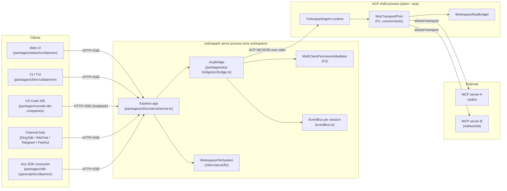
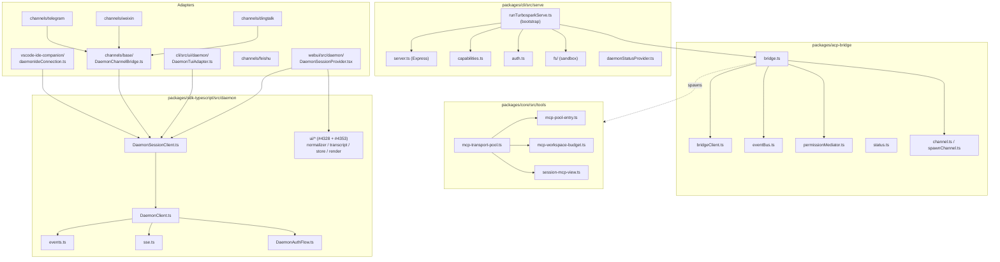
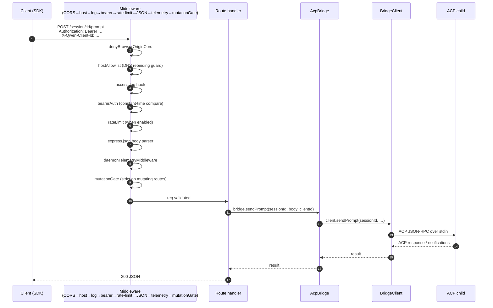
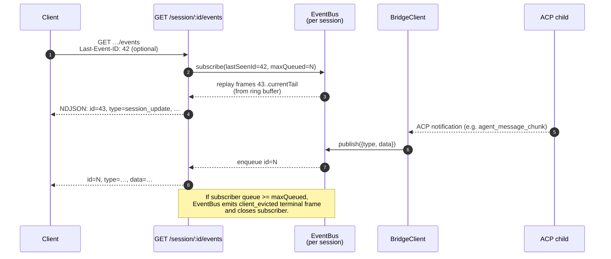
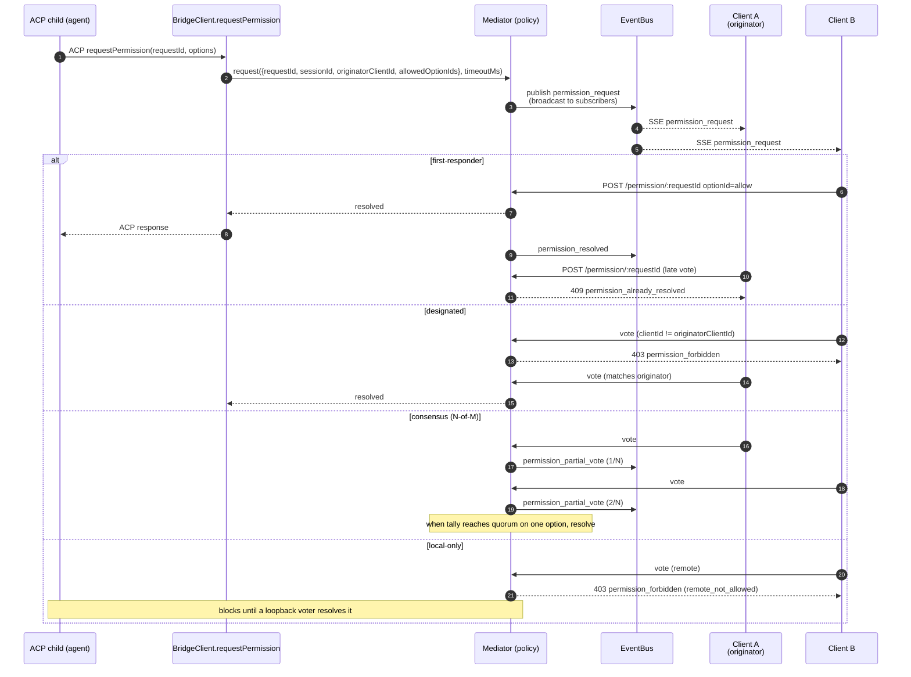
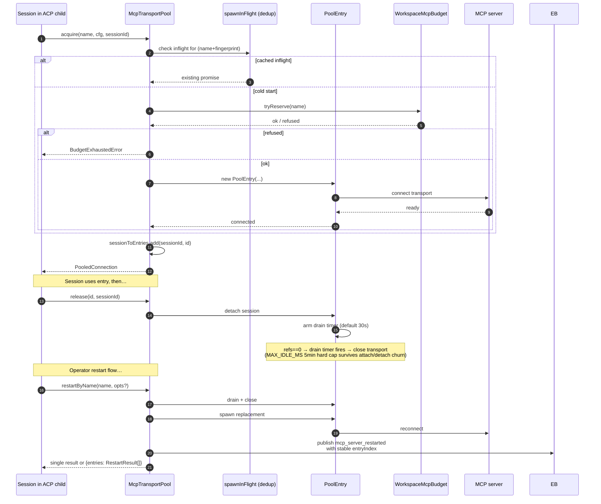
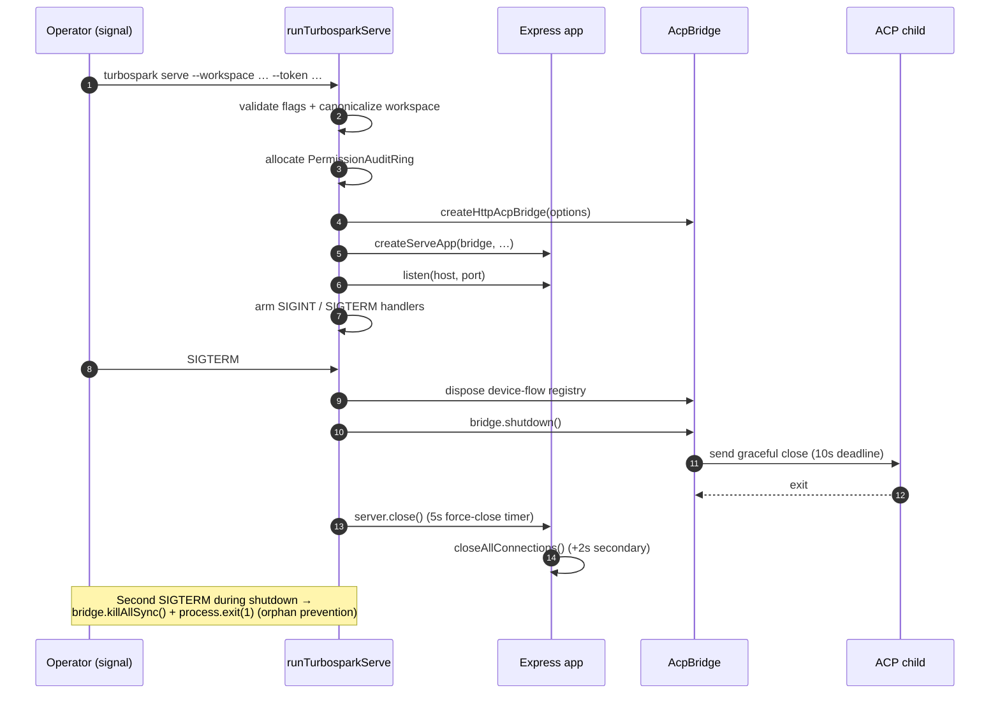

# Daemon Architecture

## Overview

A `turbospark serve` process is **one daemon = one workspace**. It hosts a single Express HTTP server, owns an `@turbospark/acp-bridge` instance, and spawns one ACP child process (`qwen --acp`) that runs the actual agent runtime. Multiple clients (CLI TUI, IDE companion, IM channel bots, web BFFs, custom scripts) connect over HTTP + SSE and either share one ACP session (`sessionScope: 'single'`, default) or split sessions by conversation thread (`sessionScope: 'thread'`).

Inside the ACP child, MCP servers are shared workspace-wide through `McpTransportPool` (F2): a single (server-name + config-fingerprint) tuple maps to one MCP transport, regardless of how many sessions discover it. The bridge's `MultiClientPermissionMediator` (F3) coordinates permission votes across all connected clients under one of four policies.

This doc gives the **system-level picture** that the rest of this documentation set builds on. Each critical flow is shown as a Mermaid sequence diagram; per-component implementation details live in the other 18 docs.

## Process topology

The daemon process and the ACP child are connected by an `AcpChannel` (default: a real subprocess stdio pipe pair; `inMemoryChannel` for tests). Everything the daemon does is shaped by this split: HTTP and SSE traffic terminate in the daemon, agent decisions and tool invocations happen in the child, and the bridge connects the two.

## Package map

Three trust boundaries matter: the HTTP edge (`serve/auth.ts` middleware chain), the bridge-to-ACP-child boundary (NDJSON over stdio, no auth; the child trusts the bridge implicitly), and the agent-to-MCP-server boundary (the agent may invoke tools that touch the host).

## Workflow 1: HTTP request lifecycle

Non-streaming routes (prompt, cancel, model switch, metadata, workspace CRUD) terminate as a single JSON reply. Streaming output is delivered out-of-band on the SSE channel, **not** as a chunked HTTP body on this connection. See workflow 2.

## Workflow 2: SSE event delivery and replay

The ring buffer is bounded (`eventRingSize`, default 8000). A reconnecting client whose `Last-Event-ID` is older than the ring's head receives a synthetic catch-up signal and must call `loadSession` / `resumeSession` to rebuild deeper state. Slow clients trigger `slow_client_warning` at 75% queue fill and `client_evicted` at the cap.

## Workflow 3: Multi-client permission mediation

Cross-policy escape hatch: any client may vote `CANCEL_VOTE_SENTINEL` to short-circuit the request as `cancelled / agent_cancelled`. The bridge guards against wire callers smuggling the sentinel via the normal `optionId` field (`InvalidPermissionOptionError`).

## Workflow 4: MCP transport pool acquire / release / restart

`releaseSession(sessionId)` uses the reverse `sessionToEntries` index to release every entry the session holds in O(refs). On daemon shutdown, `drainAll()` sets the `draining` flag (refusing new acquires) and waits for every entry to close under a configurable timeout.

## Workflow 5: Lifecycle — startup and graceful shutdown

The two-phase shutdown matters because in-flight HTTP requests, in-flight SSE subscribers, and the ACP child's in-flight tool calls all need bounded teardown windows. If anything blocks past those deadlines, the force-close path takes over so a stuck child cannot keep the daemon process alive.

## Critical files

| Concern              | File                                                        |
| -------------------- | ----------------------------------------------------------- |
| Bootstrap            | `packages/cli/src/serve/runTurbosparkServe.ts`                    |
| Express app          | `packages/cli/src/serve/server.ts`                          |
| Capability registry  | `packages/cli/src/serve/capabilities.ts`                    |
| Auth middleware      | `packages/cli/src/serve/auth.ts`                            |
| Bridge               | `packages/acp-bridge/src/bridge.ts`                         |
| BridgeClient         | `packages/acp-bridge/src/bridgeClient.ts`                   |
| Permission mediator  | `packages/acp-bridge/src/permissionMediator.ts`             |
| EventBus             | `packages/acp-bridge/src/eventBus.ts`                       |
| MCP transport pool   | `packages/core/src/tools/mcp-transport-pool.ts`             |
| Workspace MCP budget | `packages/core/src/tools/mcp-workspace-budget.ts`           |
| Workspace FS         | `packages/cli/src/serve/fs/`                                |
| SDK DaemonClient     | `packages/sdk-typescript/src/daemon/DaemonClient.ts`        |
| SDK SessionClient    | `packages/sdk-typescript/src/daemon/DaemonSessionClient.ts` |
| Event schema         | `packages/sdk-typescript/src/daemon/events.ts`              |

## References

- Design issues: [#3803](https://github.com/turbospark/turbospark/issues/3803) (daemon design), [#4175](https://github.com/turbospark/turbospark/issues/4175) (F-series milestones).
- User guide: [`../../users/turbospark-serve.md`](../../users/turbospark-serve.md).
- Wire protocol reference: [`../turbospark-serve-protocol.md`](../turbospark-serve-protocol.md).
- F2 design document: [`../../design/f2-mcp-transport-pool.md`](../../design/f2-mcp-transport-pool.md).
- F2 design notes: issue [#4175](https://github.com/turbospark/turbospark/issues/4175) commits 4-6.
