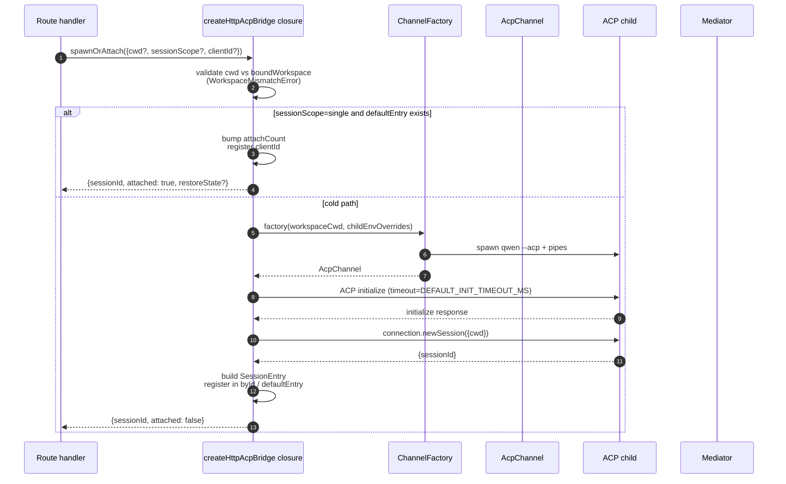
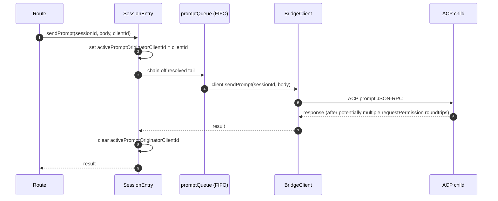
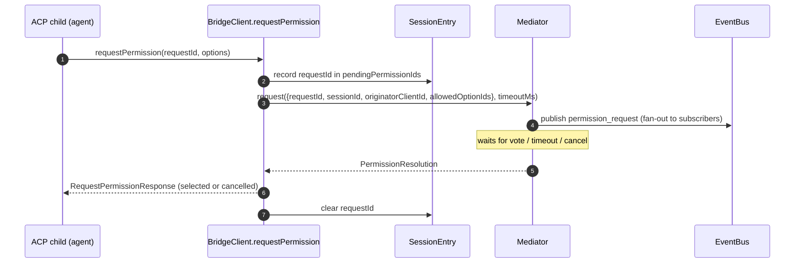
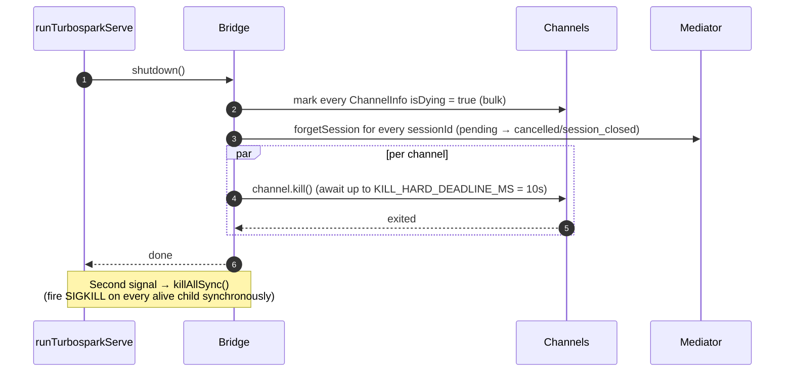

# ACP Bridge

## Overview

`packages/acp-bridge/` owns the boundary between the daemon's HTTP layer and the ACP child process. It is consumed by `packages/cli/src/serve/` (the `turbospark serve` daemon) and was extracted in #4175 F1 step 3 so future consumers (`channels/base/AcpBridge.ts`, the VS Code IDE companion) can use the same bridge core without reaching into the CLI package.

The bridge provides one `HttpAcpBridge` instance, one `AcpChannel` to the ACP child, multiplexed sessions over that channel, per-session `EventBus`es, a `MultiClientPermissionMediator`, a `BridgeFileSystem` adapter, and ACP-oriented helpers (`spawnOrAttach`, `loadSession`, `resumeSession`, `sendPrompt`, `cancelSession`, `respondToPermission`, plus extMethod RPCs for workspace status and MCP restart).

## Responsibilities

- Spawn or attach to the ACP child via a pluggable `ChannelFactory`. Default factory: `defaultSpawnChannelFactory` (subprocess `qwen --acp`). Tests inject `inMemoryChannel`.
- Maintain `aliveChannels` (channel registry) and `byId` (session registry).
- Multiplex N HTTP-side sessions onto one ACP child via `connection.newSession()`.
- Serialize per-session prompts through `promptQueue` (ACP enforces one active prompt per session).
- Per-session FIFO for `setSessionModel` calls so concurrent attaches with different models do not race the agent.
- Per-session `EventBus` that drives `GET /session/:id/events` (see [`10-event-bus.md`](./10-event-bus.md)).
- Permission flow: `BridgeClient.requestPermission` → `MultiClientPermissionMediator.request` → fan-out → vote collection → ACP response (see [`04-permission-mediation.md`](./04-permission-mediation.md)).
- File I/O: `BridgeFileSystem` adapter for ACP `readTextFile` / `writeTextFile` calls (see [`07-workspace-filesystem.md`](./07-workspace-filesystem.md)).
- extMethod RPCs for workspace-level status (`/workspace/mcp`, `/workspace/skills`, `/workspace/providers`) and MCP restart.
- Lifecycle: graceful `shutdown()` with `KILL_HARD_DEADLINE_MS` (10s) per channel; synchronous `killAllSync()` for second-signal force-exit.

## Architecture

**Public entry**: `createHttpAcpBridge(opts: BridgeOptions): HttpAcpBridge` in `packages/acp-bridge/src/bridge.ts`.

**Key types**:

| Type                            | File                    | Role                                                                                                                                                                                                                  |
| ------------------------------- | ----------------------- | --------------------------------------------------------------------------------------------------------------------------------------------------------------------------------------------------------------------- |
| `HttpAcpBridge`                 | `bridgeTypes.ts`        | Public interface: `spawnOrAttach`, `loadSession`, `resumeSession`, `sendPrompt`, `cancelSession`, `subscribeEvents`, `respondToPermission`, `getWorkspaceMcpStatus`, `restartMcpServer`, `shutdown`, `killAllSync`, … |
| `BridgeSession`                 | `bridgeTypes.ts`        | `{ sessionId, workspaceCwd, attached, clientId?, createdAt? }` returned to HTTP handlers.                                                                                                                             |
| `BridgeOptions`                 | `bridgeOptions.ts`      | Construction-time config (see [Configuration](#configuration)).                                                                                                                                                       |
| `AcpChannel`                    | `channel.ts`            | `{ stream, kill(), killSync(), exited }` — one ACP NDJSON channel.                                                                                                                                                    |
| `ChannelFactory`                | `channel.ts`            | `(workspaceCwd, childEnvOverrides?) => Promise<AcpChannel>`.                                                                                                                                                          |
| `BridgeClient`                  | `bridgeClient.ts`       | Wraps one ACP `ClientSideConnection`; implements ACP `Client` (`requestPermission`, `readTextFile`, `writeTextFile`, `sessionUpdate`, `extNotification`).                                                             |
| `EventBus`                      | `eventBus.ts`           | Per-session in-memory pub/sub. See [`10-event-bus.md`](./10-event-bus.md).                                                                                                                                            |
| `MultiClientPermissionMediator` | `permissionMediator.ts` | Four-policy mediator. See [`04-permission-mediation.md`](./04-permission-mediation.md).                                                                                                                               |

**Internal state (closed over by `createHttpAcpBridge`)**:

| State           | Shape                           | Purpose                                                                                                                                                                                                                                                                                                                                                                                                  |
| --------------- | ------------------------------- | -------------------------------------------------------------------------------------------------------------------------------------------------------------------------------------------------------------------------------------------------------------------------------------------------------------------------------------------------------------------------------------------------------- |
| `aliveChannels` | `Map<string, ChannelInfo>`      | Channel registry keyed by channel id. Each `ChannelInfo` holds `channel`, `connection`, `client` (one `BridgeClient` per channel), `sessionIds: Set<string>`, `pendingRestoreIds`, `statusClosedReject?`, `isDying: boolean`.                                                                                                                                                                            |
| `byId`          | `Map<string, SessionEntry>`     | Session registry keyed by sessionId. Each `SessionEntry` holds `channel`, `connection`, `events: EventBus`, `promptQueue: Promise<void>`, `modelChangeQueue: Promise<void>`, `pendingPermissionIds: Set<string>`, `clientIds: Map<string, count>`, `activePromptOriginatorClientId?`, `attachCount`, `spawnOwnerWantedKill`, `restoreState?`, `sessionLastSeenAt?`, `clientLastSeenAt: Map<string, ms>`. |
| `defaultEntry`  | `SessionEntry \| null`          | The "single" session used when `sessionScope: 'single'`.                                                                                                                                                                                                                                                                                                                                                 |
| `defaultPolicy` | `PermissionPolicy`              | Configured via `BridgeOptions.permissionPolicy`.                                                                                                                                                                                                                                                                                                                                                         |
| `mediator`      | `MultiClientPermissionMediator` | One per bridge instance.                                                                                                                                                                                                                                                                                                                                                                                 |
| Constants       | —                               | `DEFAULT_INIT_TIMEOUT_MS = 10_000`, `MCP_RESTART_TIMEOUT_MS = 300_000`, `DEFAULT_MAX_SESSIONS = 20`, `MAX_EVENT_RING_SIZE = 1_000_000`, `DEFAULT_PERMISSION_TIMEOUT_MS = 5min`, `DEFAULT_MAX_PENDING_PER_SESSION = 64`.                                                                                                                                                                                  |

**`isDying` invariant**: any teardown path must set `ChannelInfo.isDying = true` synchronously **before** awaiting `channel.kill()`. `ensureChannel` treats a dying channel as absent and spawns a fresh one. Without this flag a concurrent `spawnOrAttach` arriving during the SIGTERM grace window (up to 10s) would attach to a transport about to close and the caller's sessionId would 404 on every follow-up. **Set sites** (must keep in sync): `ensureChannel` (initialize failure + late-shutdown re-check), `doSpawn` (newSession failure on empty channel), `killSession` (last session leaving), `shutdown` (bulk).

**`channelInfo` retention invariant**: do **not** clear `channelInfo` when setting `isDying = true`. `killAllSync` must still find the channel during the SIGTERM grace window to fire SIGKILL on `process.exit(1)`. `aliveChannels` holds the dying entry until `channel.exited` fires.

**BridgeClient bounded buffering**: ACP `extNotification` frames arriving on `BridgeClient` for a sessionId not yet in `byId` (because `connection.newSession`'s response has not returned, but MCP discovery inside `newSession` already fired budget events) are buffered into an early-events queue bounded by `MAX_EARLY_EVENT_SESSIONS = 64` × `MAX_EARLY_EVENTS_PER_SESSION = 32` × `EARLY_EVENT_TTL_MS = 60_000`. The worst case is roughly 400 KB of heap. Without buffering, the first SSE replay-ring slot for a new session would be missing events that fired during its creation.

## Workflow

### `spawnOrAttach` (primary entry point)

Key points:

- `sessionScope='single'` with an existing `defaultEntry` only bumps
  `attachCount`, registers `clientId`, and returns `attached: true`.
- The cold path runs the ChannelFactory, performs ACP `initialize`
  (`DEFAULT_INIT_TIMEOUT_MS=10s`), calls `connection.newSession({cwd})`, then
  registers the new `SessionEntry`.
- `SessionLimitExceededError` is thrown when `byId.size >= maxSessions`.
- `InvalidClientIdError` is thrown if `X-Qwen-Client-Id` is outside
  `[A-Za-z0-9._:-]{1,128}`.
- The disconnect-reaper in `server.ts` tracks the spawn owner via
  `attachCount`/`spawnOwnerWantedKill` to avoid tearing down a session whose
  spawn owner disconnected but other clients already attached (review #3889
  BQ9tV).

### Prompt serialization

Failures at the queue tail are **swallowed** so that a prior prompt's rejection does not poison subsequent prompts; the original caller still receives the rejection on its own returned promise. The `transportClosedReject` cached on the session races the prompt promise against `channel.exited` so a crashed child surfaces immediately rather than hanging.

### Permission flow (high-level)

`InvalidPermissionOptionError` is thrown pre-mediator when a wire vote tries to inject `CANCEL_VOTE_SENTINEL` via the normal `optionId` field — the sentinel is the bridge's only escape hatch to short-circuit a request as `cancelled / agent_cancelled` and must not be reachable from the wire by accident. See [`04-permission-mediation.md`](./04-permission-mediation.md).

### Shutdown

## Channel factory

`AcpChannel` (`channel.ts`) is the bridge's transport abstraction. Production uses `defaultSpawnChannelFactory` in `spawnChannel.ts`, which runs `qwen --acp` as a subprocess with a stdio pipe pair. Tests inject `inMemoryChannel` to run the agent in-process. The bridge knows nothing about the underlying mechanism — it only needs `{ stream, kill, killSync, exited }`.

`ChannelFactory` accepts `childEnvOverrides` so each daemon handle can pass its own MCP-budget env vars (`QWEN_SERVE_MCP_CLIENT_BUDGET`, `QWEN_SERVE_MCP_BUDGET_MODE`) without mutating `process.env` (which would race when two embedded daemons run in the same Node process).

## State & Lifecycle

- Bridge construction is synchronous; the first `spawnOrAttach` cold-starts the ACP child.
- `defaultEntry` lives for the lifetime of the bridge under `sessionScope: 'single'`; the channel reaps when `sessionIds.size === 0` (after `killSession`) AND `isDying` flips true.
- `MAX_EVENT_RING_SIZE = 1_000_000` is a soft upper bound on `BridgeOptions.eventRingSize` to catch operator typos before ~500 MB per-session OOMs.
- `DEFAULT_PERMISSION_TIMEOUT_MS = 5 * 60 * 1000` keeps a wedged permission request from blocking the per-session `promptQueue` forever.
- `DEFAULT_MAX_PENDING_PER_SESSION = 64` mirrors `DEFAULT_MAX_SUBSCRIBERS`; excess `requestPermission` calls resolve as cancelled with a stderr warning.

## Dependencies

| Upstream                                                                                     | Downstream                                     |
| -------------------------------------------------------------------------------------------- | ---------------------------------------------- |
| `@agentclientprotocol/sdk` — `ClientSideConnection`, `PROTOCOL_VERSION`, ACP types           | `packages/cli/src/serve/` (the daemon)         |
| `@turbospark/turbospark-core` — `ApprovalMode`, `TrustGateError`, `getCurrentGeminiMdFilename` | `packages/channels/base/` (planned, F4)        |
| `node:crypto`, `node:fs`, `node:path`                                                        | `packages/vscode-ide-companion/` (planned, F4) |

## Configuration

`BridgeOptions` (`bridgeOptions.ts`):

| Key                                           | Default                                            | Purpose                                                                                                               |
| --------------------------------------------- | -------------------------------------------------- | --------------------------------------------------------------------------------------------------------------------- |
| `boundWorkspace`                              | (required)                                         | Canonical workspace path the bridge enforces.                                                                         |
| `sessionScope`                                | `'single'`                                         | `'single'` shares one session across all clients; `'thread'` creates a separate session for each conversation thread. |
| `channelFactory`                              | `defaultSpawnChannelFactory`                       | Pluggable ACP child factory.                                                                                          |
| `initializeTimeoutMs`                         | `DEFAULT_INIT_TIMEOUT_MS = 10_000`                 | ACP `initialize` handshake timeout.                                                                                   |
| `maxSessions`                                 | `DEFAULT_MAX_SESSIONS = 20`                        | Cap on `byId.size`. `0` / `Infinity` = unlimited; NaN/negative throws.                                                |
| `eventRingSize`                               | `DEFAULT_RING_SIZE` (from `eventBus.ts`)           | Per-session event ring; soft-capped at `MAX_EVENT_RING_SIZE`.                                                         |
| `permissionResponseTimeoutMs`                 | `DEFAULT_PERMISSION_TIMEOUT_MS = 5 min`            | Per-request wallclock for the mediator.                                                                               |
| `maxPendingPermissionsPerSession`             | `DEFAULT_MAX_PENDING_PER_SESSION = 64`             | Backpressure on high-volume agents.                                                                                   |
| `childEnvOverrides`                           | `{}`                                               | Per-handle env additions / scrubs for the ACP child.                                                                  |
| `persistApprovalMode`, `persistDisabledTools` | —                                                  | Settings-write hooks for the Wave 4 mutation routes.                                                                  |
| `contextFilename`                             | from `settings.json`'s `context.fileName`          | Overrides `getCurrentGeminiMdFilename`.                                                                               |
| `statusProvider`                              | (none)                                             | Daemon-host preflight cells (`DaemonStatusProvider`).                                                                 |
| `fileSystem`                                  | (none)                                             | `BridgeFileSystem` adapter for ACP `readTextFile` / `writeTextFile`.                                                  |
| `permissionPolicy`                            | from `settings.json`'s `policy.permissionStrategy` | One of `first-responder` / `designated` / `consensus` / `local-only`.                                                 |
| `permissionConsensusQuorum`                   | from `settings.json`                               | N for consensus policy.                                                                                               |
| `permissionAudit`                             | `createNoOpPermissionAuditPublisher()`             | Wire to `PermissionAuditRing` for the audit trail.                                                                    |
| `channelIdleTimeoutMs`                        | `0`                                                | Keep the ACP child alive for this many milliseconds after the last session closes.                                    |

## Additional bridge methods

In addition to the core `spawnOrAttach`, `sendPrompt`, `cancelSession`,
`respondToPermission`, `loadSession`, and `resumeSession` calls, the
`HttpAcpBridge` interface now includes these daemon-facing helpers:

| Method                                                       | Purpose                                       |
| ------------------------------------------------------------ | --------------------------------------------- |
| `generateSessionRecap(sessionId, context?)`                  | Generate a one-line session recap.            |
| `generateSessionBtw(sessionId, question, signal?, context?)` | Answer a side question / btw prompt.          |
| `executeShellCommand(sessionId, command, signal?, context?)` | Run a shell command on the daemon host.       |
| `getSessionContextUsageStatus(sessionId, opts?)`             | Return context-window usage.                  |
| `getSessionSupportedCommandsStatus(sessionId)`               | Return available slash commands.              |
| `getSessionTasksStatus(sessionId)`                           | Return a background-task snapshot.            |
| `getSessionStatsStatus(sessionId)`                           | Return session usage statistics.              |
| `setSessionApprovalMode(sessionId, mode, opts, context?)`    | Update approval mode for a session.           |
| `detachClient(sessionId, clientId?)`                         | Explicitly detach a client.                   |
| `addRuntimeMcpServer(name, config, originatorClientId)`      | Add an MCP server at runtime.                 |
| `removeRuntimeMcpServer(name, originatorClientId)`           | Remove an MCP server at runtime.              |
| `manageMcpServer(serverName, action, originatorClientId)`    | Enable / disable / authenticate / clear auth. |
| `generateWorkspaceAgent(description, originatorClientId)`    | Generate a subagent definition with AI.       |
| `preheat()`                                                  | Warm the ACP child before the first session.  |
| `getSessionLastEventId(sessionId)`                           | Read the session's monotonic event id.        |
| `getWorkspaceToolsStatus()`                                  | Return the built-in tool registry snapshot.   |
| `getWorkspaceMcpToolsStatus(serverName)`                     | Return tools for a specific MCP server.       |

`BridgeSpawnRequest.sessionScope` was renamed from `'per-client'` to
`'thread'`. `BridgeRestoredSession` now carries `compactedReplay`,
`liveJournal`, and `lastEventId`. `BridgeClientRequestContext` is the request
context threaded through bridge calls; it carries `clientId`,
`fromLoopback: boolean`, and `promptId`.

## Caveats & Known Limits

- `MCP_RESTART_TIMEOUT_MS = 300_000` (5 min) — the bridge timeout for `/workspace/mcp/:server/restart` is intentionally large because `McpClientManager.MAX_DISCOVERY_TIMEOUT_MS` can be up to 5 min for stdio servers. A shorter deadline would produce false timeouts while the ACP child kept reconnecting in the background.
- `BridgeOptions.eventRingSize > 1_000_000` throws at construction.
- `connection.unstable_resumeSession` is exposed through the stable `session_resume` daemon capability; `unstable_session_resume` remains advertised as a deprecated compatibility alias for older SDKs. Clients should feature-detect `session_resume`.
- The bridge package is `@turbospark/acp-bridge` and is consumed through re-export shims in `serve/eventBus.ts`, `serve/status.ts`, `serve/httpAcpBridge.ts` for backward compatibility with pre-F1 import paths. New code should import directly.

## References

- `packages/acp-bridge/src/bridge.ts` (esp. `createHttpAcpBridge` at line 350+)
- `packages/acp-bridge/src/bridgeClient.ts`
- `packages/acp-bridge/src/bridgeTypes.ts`
- `packages/acp-bridge/src/bridgeOptions.ts`
- `packages/acp-bridge/src/channel.ts`
- `packages/acp-bridge/src/spawnChannel.ts`
- `packages/acp-bridge/src/bridgeErrors.ts`
- Issues: [#3803](https://github.com/turbospark/turbospark/issues/3803), [#4175](https://github.com/turbospark/turbospark/issues/4175).
