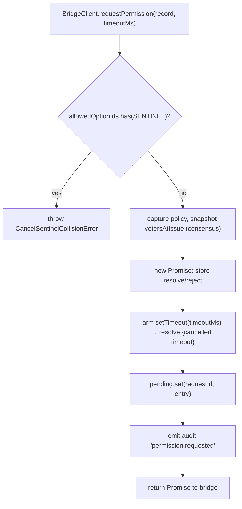
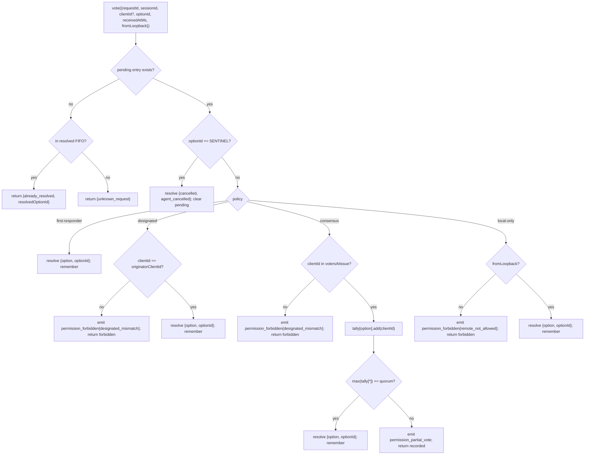

# Multi-Client Permission Mediation

## Overview

When the ACP child's agent calls `requestPermission`, the daemon does not simply forward it to one client. Under `sessionScope: 'single'`, every connected client sees the request and any of them may respond. Without mediation, late votes have nowhere to go, two clients can race the same request, and a single rogue client can override the originator.

`MultiClientPermissionMediator` (`packages/acp-bridge/src/permissionMediator.ts`) implements the `PermissionMediator` contract (`packages/acp-bridge/src/permission.ts`) and owns all pending and resolved permission state for the bridge. It dispatches votes through one of four policies declared in `PermissionPolicy`:

| Policy            | Resolution rule                                                                                                        | Use case                                                                 |
| ----------------- | ---------------------------------------------------------------------------------------------------------------------- | ------------------------------------------------------------------------ |
| `first-responder` | First valid vote wins; later voters get `permission_already_resolved`.                                                 | Live cross-client collaboration UX (default).                            |
| `designated`      | Only the prompt's `originatorClientId` may resolve; others see `permission_forbidden{designated_mismatch}`.            | Per-tenant SaaS where the UI surface must own its own approvals.         |
| `consensus`       | N-of-M quorum across the v1 client-id snapshot; intermediate `permission_partial_vote` events let UIs render progress. | Enterprise change review where two operators must agree.                 |
| `local-only`      | Refuses any non-loopback voter; blocks until a loopback client resolves.                                               | Workstations where remote control must never grant privilege escalation. |

> **v1 security limit**: `X-Qwen-Client-Id` is self-reported. `designated` and
> `consensus` do not yet have proof-of-possession. A client that observes
> `originatorClientId` can reuse that id. `{outcome:'cancelled'}` also routes
> through the cancel sentinel before policy dispatch, so even `local-only`
> cannot treat cancel as a policy-protected resolve. For strong isolation, bind
> the daemon to loopback or put it behind an authenticated reverse proxy. See
> [Security note: v1 client identity is self-reported](#security-note-v1-client-identity-is-self-reported).

## Responsibilities

- Track every pending request (`request → vote → resolved` lifecycle).
- Arm and disarm per-request wallclock timeouts (the **N1 invariant**: the timeout must be armed synchronously inside `request()` so an immediately cancelled session cannot leak a permanently pending closure).
- Dispatch votes through the policy captured at `request()` time (changing daemon policy mid-flight does not affect in-flight requests).
- Maintain a bounded FIFO (`MAX_RESOLVED_PERMISSION_RECORDS = 512`) of recently-resolved requests so duplicate votes get a structured `already_resolved` rather than `unknown_request`.
- Emit `permission_partial_vote` (consensus) and `permission_forbidden` (designated / consensus / local-only) on the per-session EventBus.
- Resolve pending requests as `{kind: 'cancelled', reason: 'session_closed'}` via `forgetSession(sessionId)` on session teardown.
- Reject malicious or accidental injection of `CANCEL_VOTE_SENTINEL` through the wire (`InvalidPermissionOptionError`) and through agent-published option labels (`CancelSentinelCollisionError`).

## Architecture

### Public surface

```ts
interface PermissionMediator {
  readonly policy: PermissionPolicy;
  request(
    record: PermissionRequestRecord,
    timeoutMs: number,
  ): Promise<PermissionResolution>;
  vote(vote: PermissionVote): PermissionVoteOutcome;
  forgetSession(sessionId: string): void;
}
```

`MultiClientPermissionMediator` adds: `peekSessionFor(requestId)`, `pendingCount(sessionId)`, internal audit publisher, etc. `BridgeClient` only depends on the `request()` half (structural sub-typing — see `bridgeClient.ts`).

### `PermissionPolicy` and `PermissionVoteOutcome`

```ts
type PermissionPolicy =
  | 'first-responder'
  | 'designated'
  | 'consensus'
  | 'local-only';

type PermissionVoteOutcome =
  | { kind: 'resolved'; resolvedOptionId: string }
  | { kind: 'recorded'; votesNeeded: number } // consensus partial
  | { kind: 'already_resolved'; resolvedOptionId: string }
  | { kind: 'forbidden'; reason: 'designated_mismatch' | 'remote_not_allowed' }
  | { kind: 'unknown_request' };

type PermissionResolution =
  | { kind: 'option'; optionId: string }
  | {
      kind: 'cancelled';
      reason: 'timeout' | 'session_closed' | 'agent_cancelled';
    };
```

### Cancel sentinel

`CANCEL_VOTE_SENTINEL = '__cancelled__'`. The bridge maps voter `{outcome:'cancelled'}` to this sentinel **before** calling `mediator.vote`. The mediator routes the sentinel **before** policy dispatch — voter-cancel works under every policy regardless of `clientId` / loopback / membership. Two guards:

1. **`bridge.ts`** rejects wire votes whose `optionId === CANCEL_VOTE_SENTINEL` with `InvalidPermissionOptionError` (a malicious wire client must not be able to inject cancel by lying about an `optionId`).
2. **`mediator.request`** rejects records whose `allowedOptionIds` contains the sentinel with `CancelSentinelCollisionError` (an agent legitimately publishing `'__cancelled__'` as an option label must not be able to masquerade).

This deliberate cross-policy escape is documented at `permissionMediator.ts` so a future maintainer does not accidentally remove the bypass.

### Pending state

Each pending request is keyed by `requestId` and carries:

- `policy` — captured at `request()` time.
- `record: PermissionRequestRecord` (requestId, sessionId, originatorClientId, allowedOptionIds, issuedAtMs).
- `resolve` / `reject` closures.
- `votesAtIssue` (consensus only) — snapshot of registered `clientIds` for the session at issue time; later votes are rejected if not in this set.
- `tally` (consensus only) — `Map<optionId, Set<clientId>>` counting votes per option.
- `timeoutHandle` — Node timeout armed inside `request()` (N1 invariant).
- `auditTrail[]` — per-vote audit records.

### Resolved FIFO

`MAX_RESOLVED_PERMISSION_RECORDS = 512`. Eviction is FIFO via `resolvedOrder.shift()` (DeepSeek review #4335 / 3271627446 — mirrors `PermissionAuditRing`). Stores only `{requestId, sessionId, outcome}`, so 512 records stay under 100 KB across normal UI reconnect/race windows.

## Workflow

### `request()` (N1 invariant)



The timer is armed **before** the entry is even visible elsewhere. Without this, a `forgetSession` arriving between `pending.set` and `setTimeout` would leave the entry pending with no timeout — the bridge's per-session `promptQueue` would hang forever.

### `vote()` dispatch



### `forgetSession()`

Called on session close, eviction, and bridge shutdown. For every pending entry whose `record.sessionId === sessionId`:

1. Cancel the timeout.
2. Resolve the pending Promise with `{kind: 'cancelled', reason: 'session_closed'}`.
3. Append an audit record.
4. Remove from `pending`.

The bridge's session-teardown path always calls `forgetSession` **before** the channel-kill window so pending permissions do not outlive their session.

## State & Lifecycle

- `policy` is captured per-request. Changing daemon-wide policy (future surface) does not affect in-flight requests.
- `votesAtIssue` (consensus) is captured at `request()` time; clients that arrive after the request can vote, but if their `clientId` was not already registered with the session at issue time, their vote is rejected as `designated_mismatch`. This intentionally reuses the `designated` policy's mismatch reason to keep the contract closed; future versions may split the union if SDK consumers need to distinguish.
- Resolved entries live in the FIFO for at most `MAX_RESOLVED_PERMISSION_RECORDS` (512). After eviction a duplicate vote on the same `requestId` returns `{unknown_request}`.
- `permission_partial_vote` only fires for `consensus`. Don't depend on it under any other policy.
- `permission_forbidden` fires for `designated`, `consensus`, and `local-only` — not `first-responder`.

## Dependencies

- [`03-acp-bridge.md`](./03-acp-bridge.md) — how the bridge wires `BridgeClient.requestPermission` to `mediator.request`.
- [`10-event-bus.md`](./10-event-bus.md) — how partial-vote and forbidden frames reach clients.
- [`09-event-schema.md`](./09-event-schema.md) — payload contracts for `permission_*` events.
- [`08-session-lifecycle.md`](./08-session-lifecycle.md) — `forgetSession()` is called on every session termination.
- [`02-serve-runtime.md`](./02-serve-runtime.md) — `PermissionAuditRing` (512-entry FIFO of audit records).

## Configuration

| Source              | Knob                                                                                                   | Effect                                |
| ------------------- | ------------------------------------------------------------------------------------------------------ | ------------------------------------- |
| `settings.json`     | `policy.permissionStrategy`                                                                            | Active mediator policy.               |
| `settings.json`     | `policy.consensusQuorum`                                                                               | N for consensus.                      |
| `BridgeOptions`     | `permissionPolicy`, `permissionConsensusQuorum`, `permissionAudit`                                     | Programmatic override.                |
| Capability tag      | `permission_mediation` (always; `modes: ['first-responder', 'designated', 'consensus', 'local-only']`) | Build-supported set.                  |
| Capability envelope | `policy.permission`                                                                                    | Active policy this daemon is running. |

If `policy.permissionStrategy` is not explicitly configured, the daemon uses
`first-responder`. `designated`, `consensus`, and `local-only` only take effect
when set in `settings.json`.

## Consensus quorum: default formula and the M=2 edge

When the `consensus` policy is active and `policy.consensusQuorum` is not set,
the mediator computes **N = floor(M/2) + 1** via `consensusQuorumFor` in
`permissionMediator.ts`:

```ts
Math.max(1, Math.floor(m / 2) + 1);
```

| M (`votersAtIssue.size`) | Default N | Behavior                        |
| ------------------------ | --------- | ------------------------------- |
| 1                        | 1         | One voter resolves immediately. |
| 2                        | 2         | Requires unanimous agreement.   |
| 3                        | 2         | Majority.                       |
| 4                        | 3         | More than half.                 |
| 5                        | 3         | Majority.                       |
| 6                        | 4         | More than half.                 |

For **M = 2**, split votes (A selects X, B selects Y) can only be resolved by
the per-permission timeout: no option reaches unanimity, so the request waits
until `permissionResponseTimeoutMs` (default 5 min) and resolves as
`{cancelled, timeout}`. The vote-advance path logs this "unanimity means split
votes time out" behavior to stderr for operators.

Operators who want first-vote-wins behavior for M = 2 can explicitly set
`policy.consensusQuorum: 1`. Stricter configurations, such as requiring
unanimity for M = 4, use the same field.

## Boot-time policy validation

`runTurbosparkServe.validatePolicyConfig(policyConfig)`
(`packages/cli/src/serve/runTurbosparkServe.ts`) validates merged `settings.json`
`policy.*` at boot and throws `InvalidPolicyConfigError` for operator mistakes:

- `policy.permissionStrategy` is set but not in the four supported modes. The
  valid set is derived at runtime from
  `SERVE_CAPABILITY_REGISTRY.permission_mediation.modes`, the single source of
  truth for capability advertisement.
- `policy.consensusQuorum` is set but is not a positive integer.

There is also a soft stderr warning when `consensusQuorum` is set while
`permissionStrategy !== 'consensus'`; the override would otherwise be silently
ignored under non-consensus policies.

`InvalidPolicyConfigError` is exported for `instanceof` tests. `runTurbosparkServe`
uses it to distinguish operator misconfiguration, which is rethrown as an
explicit boot failure, from settings read I/O failures, which fall back to
defaults.

## Security note: v1 client identity is self-reported

`X-Qwen-Client-Id` is supplied by the HTTP client. In v1, the daemon validates
the format (`[A-Za-z0-9._:-]{1,128}`) and tracks attached client ids in
`clientIds`, but it does not perform proof-of-possession. Any client that can
observe `originatorClientId` in SSE can register with the same id and
impersonate that originator in later requests.

Policy impact:

- **`first-responder`** is unaffected because it does not depend on identity.
- **`designated`** can be spoofed by a remote client reusing
  `originatorClientId`.
- **`consensus`** gates on the issue-time `votersAtIssue` snapshot; if a spoofed
  id is already attached when the request is issued, it can vote.
- **`local-only`** is immune to id spoofing because `fromLoopback: boolean` is
  stamped by the daemon from the connection remote address, not supplied by the
  client.

A future pair-token mechanism will issue a per-session secret from
`POST /session` and require it on `designated` / `consensus` votes. That
mechanism does not exist in v1.

## Caveats & Known Limits

- **Cancel sentinel routes BEFORE policy dispatch** by design — a `local-only` daemon and a `consensus` daemon can both be cancelled by any voter who posts `{outcome: 'cancelled'}`. This is documented at `permissionMediator.ts` and is the agent-side abort path.
- **`designated` and `consensus` overload `designated_mismatch`** in `PermissionVoteOutcome`. The mediator emits separate audit records but the wire shape is single. Future protocol versions may split the union.
- **Anonymous voters (no `X-Qwen-Client-Id`)** are accepted under `first-responder` and `local-only` (loopback) only; `designated` and `consensus` reject them.
- **Cross-policy escape hatch** means cancel cannot be gated by policy. If a deployment needs policy-gated cancel that would be a future contract change — do not paper-over with route-level checks.
- **`votesAtIssue` snapshot semantics** mean a consensus deployment with a churning client set can have legitimate clients rejected because they connected after the request was issued. Operators should pre-register collaborator client ids before issuing change-review prompts.

## References

- `packages/acp-bridge/src/permission.ts` (frozen contract)
- `packages/acp-bridge/src/permissionMediator.ts` (F3 mediator implementation)
- `packages/acp-bridge/src/bridgeClient.ts` (uses structural sub-typing on `PermissionMediator`)
- `packages/acp-bridge/src/bridgeErrors.ts` (`CancelSentinelCollisionError`, `InvalidPermissionOptionError`, `PermissionForbiddenError`)
- `packages/cli/src/serve/permissionAudit.ts` (audit ring + publisher)
- Issue: [#4175](https://github.com/turbospark/turbospark/issues/4175) F3 series.
