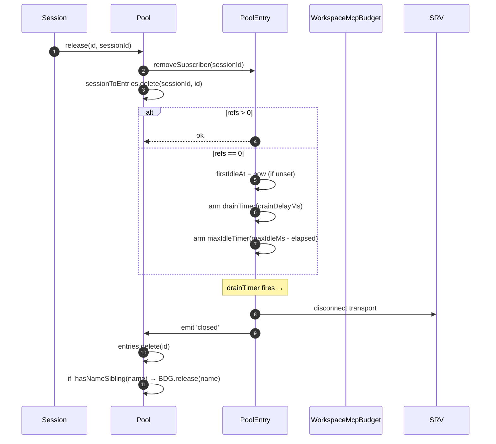
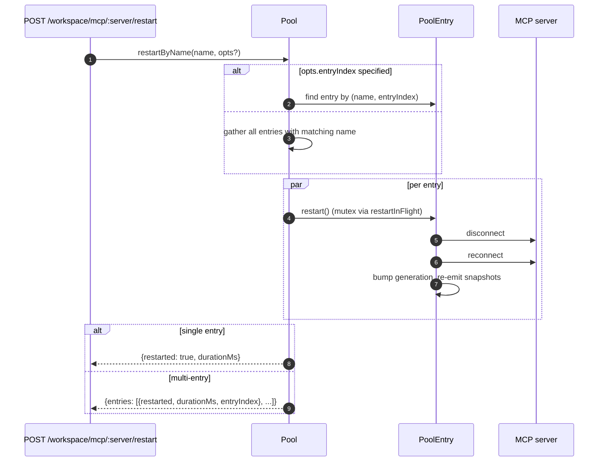
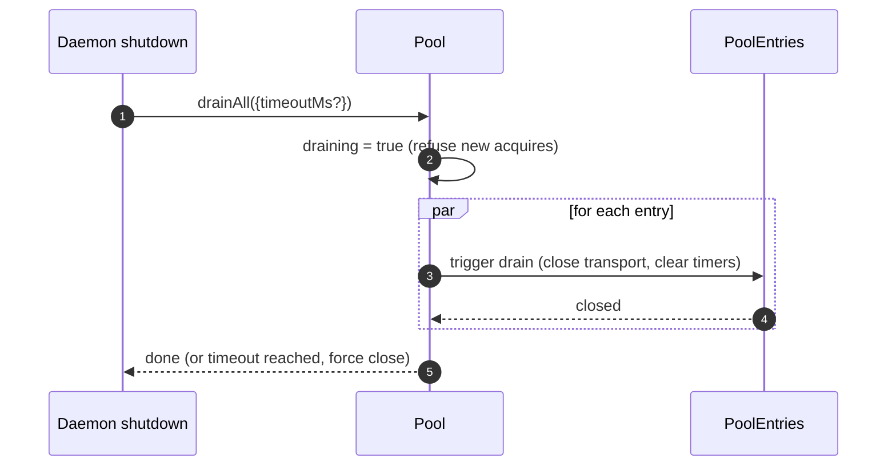

# Workspace MCP Transport Pool

## Overview

`McpTransportPool` (`packages/core/src/tools/mcp-transport-pool.ts`) is the F2 (#4175 commit 5) workspace-scoped pool: multiple ACP sessions on one daemon share one transport per unique `(serverName + configFingerprint)` tuple, instead of each spawning its own MCP child process. The pool lives **inside the ACP child** (`TurbosparkAgent.mcpPool`), is constructed once at agent startup with the daemon's bootstrap `Config`, and survives session lifecycles. Entries reference-count session attaches and close after a configurable grace period when the reference count reaches zero.

It is the main mechanism that prevents a multi-session daemon from forking one copy of every MCP server per session.

## Responsibilities

- Acquire or spawn one MCP transport per `(name + fingerprint)`, deduplicating concurrent acquires via `spawnInFlight`.
- Release per-session references; arm the entry's drain timer when the last reference detaches.
- Survive ref-count churn with a hard `MAX_IDLE_MS` cap so a thrashing client cannot keep an idle transport alive forever.
- Reference-count sessions in a reverse index (`sessionToEntries`) so `releaseSession(sessionId)` is O(refs) rather than O(entries).
- Restart entries on demand (`restartByName`) — single-entry returns `{restarted, durationMs}`, multi-entry returns `{entries: RestartResult[]}` (F2 multi-entry contract).
- Drain the entire pool on daemon shutdown with a configurable timeout; refuse new acquires while draining.
- Consult `WorkspaceMcpBudget` (see [`06-mcp-budget-guardrails.md`](./06-mcp-budget-guardrails.md)) on `acquire` to enforce per-name reservation caps; release the slot on entry close when no sibling entry holds the same name.
- Produce per-session filtered tool/prompt snapshots via `SessionMcpView` so a discovery in one session does not register tools into other sessions.

## Architecture

### Public surface

```ts
class McpTransportPool {
  constructor(cliConfig: Config, options: McpTransportPoolOptions);
  acquire(
    serverName,
    cfg,
    sessionId,
    sessionToolRegistry,
    sessionPromptRegistry,
  ): Promise<PooledConnection>;
  release(id, sessionId): void;
  releaseSession(sessionId): void;
  restartByName(
    name,
    opts?,
  ): Promise<RestartResult | { entries: RestartResult[] }>;
  drainAll(opts?): Promise<void>;
  getBudget(): WorkspaceMcpBudget | undefined;
  getSnapshot(): McpPoolSnapshot;
}
```

`McpTransportPoolOptions`:

- `workspaceContext: WorkspaceContext` (required).
- `debugMode: boolean`.
- `sendSdkMcpMessage?` — per-session callback (pool bypasses SDK MCP).
- `pooledTransports?: ReadonlySet<McpTransportKind>` — default `{stdio, websocket}`. HTTP/SSE transports stay unpooled by default because their headers can carry session-specific OAuth state, but operators can explicitly opt them into pooling with `QWEN_SERVE_MCP_POOL_TRANSPORTS`.
- `drainDelayMs?` — default `30_000`.
- `entryOptions?: (transport) => PoolEntryOptions`.
- `budget?: WorkspaceMcpBudget`.

### Internal state

| State              | Type                                    | Purpose                                                                                              |
| ------------------ | --------------------------------------- | ---------------------------------------------------------------------------------------------------- |
| `entries`          | `Map<ConnectionId, PoolEntry>`          | Live pool entries keyed by `connectionIdOf(name, fingerprint)`.                                      |
| `unpooledIds`      | `Set<ConnectionId>`                     | Entries for transports outside the configured `pooledTransports` allowlist.                          |
| `spawnInFlight`    | `Map<ConnectionId, Promise<PoolEntry>>` | Deduplicates concurrent cold acquires for the same key.                                              |
| `sessionToEntries` | `Map<string, Set<ConnectionId>>`        | V21-2 reverse index for O(refs) `releaseSession`.                                                    |
| `draining`         | `boolean`                               | Drain mutex — once set, all `acquire` calls reject.                                                  |
| `nextIndexByName`  | `Map<string, number>`                   | V21-7 monotonic `entryIndex` per server name (dashboards do not reshuffle when a new entry appears). |

### `PoolEntry` (per-entry structure, `mcp-pool-entry.ts`)

State machine: `spawning → active ⇄ (active ↔ reconnect) → (active → draining on last detach, draining → active on attach OR draining → closed on timer)`.

| Field                                                  | Purpose                                                                         |
| ------------------------------------------------------ | ------------------------------------------------------------------------------- |
| `localStatus: MCPServerStatus`                         | Driven by `MCPServerStatus` lifecycle.                                          |
| `state: PoolEntryState`                                | `spawning`/`active`/`draining`/`closed`/`failed`.                               |
| `generation: number`                                   | Bumped on each restart; subscribers compare to detect reconnect cycles.         |
| `refs: Set<string>`                                    | Session ids currently attached.                                                 |
| `subscribers: Map<string, SessionMcpView>`             | Per-session filtered views.                                                     |
| `subscriberHandles: Map<string, PooledConnectionImpl>` | Handles returned from `acquire`.                                                |
| `toolsSnapshot[], promptsSnapshot[]`                   | Canonical pool-level snapshots; re-issued on `toolsChanged` / `promptsChanged`. |
| `drainTimer?`                                          | Armed when `refs.size === 0`; default 30s. Reset on attach.                     |
| `maxIdleTimer?`                                        | Armed at first idle; never reset by acquire/release churn. Default 5 min.       |
| `firstIdleAt?`                                         | Watermark for the max-idle hard cap.                                            |
| `restartInFlight?`                                     | Mutex for `restart()`.                                                          |

### `PoolEntryOptions`

```ts
interface PoolEntryOptions {
  drainDelayMs: number; // default 30_000
  maxIdleMs: number; // default 5 * 60_000
  maxReconnectAttempts: number; // default 3 (stdio/ws) or 5 (http/sse)
  reconnectStrategy:
    | { kind: 'fixed'; delayMs: number }
    | { kind: 'exponential'; baseMs: number; capMs: number };
}
```

`defaultPoolEntryOptions(transport)` (`mcp-pool-entry.ts`) returns stdio/ws defaults `{fixed 5s, 3 attempts}` and http/sse defaults `{exponential 1s → 16s, 5 attempts}`. Remote transports get longer retry budgets because their failures are more often transient.

## Workflow

### `acquire`

```mermaid
sequenceDiagram
    autonumber
    participant S as Session
    participant P as Pool
    participant SIF as spawnInFlight
    participant E as PoolEntry
    participant BDG as WorkspaceMcpBudget
    participant SRV as MCP server

    S->>P: acquire(name, cfg, sessionId, sessionToolRegistry, sessionPromptRegistry)
    P->>P: refuse if draining
    P->>P: connectionId = connectionIdOf(name, fingerprint)
    P->>P: if !isPoolable(cfg) → mark unpooled
    alt entry in entries (warm)
        E-->>P: existing PoolEntry
    else inflight cold spawn
        SIF-->>P: existing Promise<PoolEntry>
    else cold start
        P->>BDG: tryReserve(name) (if budget set + poolable)
        BDG-->>P: 'reserved' | 'already_held' | 'refused'
        alt refused
            P->>BDG: recordRefusal(name, transport)
            P-->>S: BudgetExhaustedError
        else ok
            P->>E: spawnEntry(name, cfg)
            E->>SRV: connect transport
            SRV-->>E: ready
            P->>P: entries.set(id, E); nextIndexByName++
            E-->>P: connected
        end
    end
    P->>E: addSubscriber(sessionId, sessionToolRegistry, sessionPromptRegistry)
    P->>P: sessionToEntries.add(sessionId, id)
    P->>P: cancel drain timer (refs>0)
    P-->>S: PooledConnection { id, serverName, entryIndex, client, toolsSnapshot, promptsSnapshot, on, off, release }
```

### `release` + drain



`hasNameSibling(name)` (`mcp-transport-pool.ts`) iterates both `entries.values()` and `spawnInFlight.keys()` parsing the latter with `parseConnectionId` (server names can legitimately contain `::`, so `startsWith` would false-positive on a sibling name beginning with `${name}::`).

`releaseSession(sessionId)` reads from `sessionToEntries`, releases all referenced entries in O(refs), then clears the index entry. Used by the bridge's session-close path so it does not iterate the full entry map.

### `restartByName`



The preflight budget check at the daemon HTTP layer returns `{restarted:false, skipped:true, reason:'budget_would_exceed'}` (Wave 4 mutation control) when the target's slot is not already reserved and a restart would push live count over `enforce` budget.

### `drainAll`



## State & Lifecycle

- Pool construction is synchronous; first `acquire` cold-starts a transport.
- `drainDelayMs` (default 30s) is reset to cancellation on attach.
- `maxIdleMs` (default 5 min) is **never** reset by attach/detach — it starts ticking at the FIRST idle and only stops when the entry actually closes or attaches before the deadline. Defense against thrashing clients.
- `nextIndexByName` is monotonic. Old entries keep their assigned index even after newer ones appear, so dashboards reading `entryIndex` do not reshuffle.
- Spawn failure releases the reserved budget slot (V21-4 — without this, a cold spawn that crashed mid-connect would leak the reservation forever).

## Dependencies

- `packages/core/src/tools/mcp-client.ts` — `McpClient`, status enum, `SendSdkMcpMessage`.
- `packages/core/src/tools/mcp-pool-entry.ts` — `PoolEntry`, `PoolEntryOptions`, `defaultPoolEntryOptions`.
- `packages/core/src/tools/mcp-pool-key.ts` — `connectionIdOf`, `parseConnectionId`, `isPoolable`, `mcpTransportOf`, `POOLED_TRANSPORTS_DEFAULT`.
- `packages/core/src/tools/mcp-pool-events.ts` — `ConnectionId`, `PoolEntryState`, `PoolEvent`.
- `packages/core/src/tools/session-mcp-view.ts` — per-session view that filters pool snapshots.
- `packages/core/src/tools/mcp-workspace-budget.ts` — `WorkspaceMcpBudget` (see [`06-mcp-budget-guardrails.md`](./06-mcp-budget-guardrails.md)).
- `packages/core/src/tools/mcp-discovery-timeout.ts` — `discoveryTimeoutFor`, `runWithTimeout`.

## Configuration

| Source                        | Knob                                                            | Effect                                                                                                    |
| ----------------------------- | --------------------------------------------------------------- | --------------------------------------------------------------------------------------------------------- |
| Env                           | `QWEN_SERVE_NO_MCP_POOL=1`                                      | Kill switch — `TurbosparkAgent.mcpPool` stays undefined; per-session `McpClientManager` enforces (pre-F2 path). |
| Flag                          | `--mcp-client-budget=N`, `--mcp-budget-mode={off,warn,enforce}` | Forwarded to ACP child via `childEnvOverrides`; child constructs `WorkspaceMcpBudget` and passes to pool. |
| Capability tags (conditional) | `mcp_workspace_pool`, `mcp_pool_restart`                        | Advertised together when pool is on. SDK pre-flights both to branch on pool-aware response shapes.        |

### Unpooled entries (HTTP / SSE / SDK-MCP)

Transports outside the configured `pooledTransports` allowlist (HTTP, SSE, and SDK-MCP by default) take a separate path: `createUnpooledConnection(name, cfg, sessionId, ...)` (`mcp-transport-pool.ts`) creates a per-session entry with id `${name}::unpooled-${entryIndex}`. Differences from pooled entries:

- Stored in `entries` AND tracked in `unpooledIds: Set<ConnectionId>` so `release` / `releaseSession` can fast-path the close-on-detach behavior (refs always max out at 1).
- `McpClient.discover()` is used directly instead of pool replay; `applyTools` / `applyPrompts` are no-ops because the session's registries already hold what was registered (W77 / `skipReplay: true` in `attach()`).
- Workspace budget still gates them — the F2 budget follow-up closed the prior loophole where unpooled connections bypassed `tryReserve`; the same `WorkspaceMcpBudget` slot is reserved and released on entry close (whether pooled or unpooled).

The W77 race (`cb206da36`): `createUnpooledConnection` stores the entry in `this.entries` BEFORE awaiting `client.connect()` / `client.discover()`, but only indexes `sessionToEntries[sessionId]` AFTER `attach()` succeeds. A concurrent `closeStoredSession()` / `releaseSession(sessionId)` during the connect/discover window saw an empty index, let the unpooled spawn finish, and `attach()` then registered tools/prompts into an already-closed session. The fix:

- `mcp-pool-entry.ts`: public `isTerminated(): boolean` probe (`state === 'closed' || state === 'failed'`).
- `mcp-pool-entry.ts`: `markActive()` short-circuits if `isTerminated()` so a torn-down entry cannot be resurrected to `'active'`.
- Callers (the pool's unpooled path) probe `isTerminated()` between the awaits and abort the attach if the parent session went away.

This race was latent at the time (the W61/W71 per-session `releaseSession` hooks land in F4), but would become live the moment that hook arrived. The fix was applied early in the F2 series.

## `GET /workspace/mcp` pool-aware snapshot fields

When the pool is active, each `ServeWorkspaceMcpStatus` server cell
(`packages/acp-bridge/src/status.ts`) includes three additional fields:

| Field            | Type                                        | Purpose                                                                                                                                                                                                                                                                                                                                       |
| ---------------- | ------------------------------------------- | --------------------------------------------------------------------------------------------------------------------------------------------------------------------------------------------------------------------------------------------------------------------------------------------------------------------------------------------- |
| `disabledReason` | `'config' \| 'budget'`                      | Distinguishes operator-disabled servers (`disabled: true` from `disabledMcpServers`) from budget refusal (`status: 'error', errorKind: 'budget_exhausted'`). Dashboards can render one server row without cross-reading `errors[]` or `budgets[]`.                                                                                            |
| `entryCount`     | `number` (`>=1`)                            | In pool mode a workspace can have multiple `PoolEntry` instances with the same name when sessions inject different fingerprints such as per-session OAuth headers. This field is absent when `QWEN_SERVE_NO_MCP_POOL=1` disables the pool. New clients render an "N entries" badge when `entryCount > 1`.                                     |
| `entrySummary`   | `ReadonlyArray<{entryIndex, refs, status}>` | Per-entry breakdown. `entryIndex` is the stable opaque integer assigned when the entry was created; it is not the raw fingerprint, so snapshot diffs do not leak OAuth or env rotation timing. `refs` is the current attached-session count. `status` lets dashboards show per-entry health while aggregate `mcpStatus` is already connected. |

`(entryCount, entrySummary)` are always broadcast as a pair. The
`mcp_workspace_pool` capability tag implies both fields. Older SDK clients
ignore them under the additive protocol contract.

Pool snapshots also expose `subprocessCount`. It counts only the `'stdio'`
family. WebSocket, HTTP, and SSE transports connect to remote servers and do
not spawn local child processes. Early versions counted WebSocket transports as
local subprocesses, which inflated resource dashboards.

## Drain runs from both shutdown paths

Pool drain is not limited to the SIGTERM handler. The normal IDE shutdown path
(`await connection.closed`) also calls `drainAll` via
`packages/cli/src/acp-integration/acpAgent.ts`'s `drainPoolBeforeExit`. Whether
the daemon receives a process signal or the IDE closes its connection cleanly,
the pool enters `draining`, refuses new acquires, and waits for entries to
close.

## `/mcp refresh` shares the boot discovery path

`discoverAllMcpTools` (boot discovery) and
`discoverAllMcpToolsIncremental` (`/mcp refresh` / hot reload) both consult the
pool first in pool mode (`packages/core/src/tools/mcp-client-manager.ts`). The
shared gate prevents hot reload from accidentally creating a per-session
client, double-counting budget, or leaving an orphan transport behind.

## In-flight tool calls during reconnect (`MCPCallInterruptedError`)

When the underlying MCP transport silently disconnects (the connection jumps
from `'active'` / `'draining'` to `localStatus === DISCONNECTED` without an
explicit close), the pool marks the entry `'failed'`, evicts it from
`pool.entries`, and emits the `failed` event before detaching subscriber views.
That emit-before-detach order matters: subscribers receive the `failed` event
soon enough to route pending `callTool` promises to
`MCPCallInterruptedError`, so a stuck `await client.callTool(...)` rejects
cleanly instead of hanging. `forceShutdown` uses the same emit-then-detach
ordering.

## Fingerprint and `canonicalOAuth` normalization

The pool key comes from `fingerprint(cfg)` in `mcp-pool-key.ts`. The hash covers
all transport-defining fields:

> `transport, command, args, cwd, env, url, httpUrl, tcp, headers, timeout, oauth`

Per-session filtering and metadata fields (`includeTools`, `excludeTools`,
`trust`, `description`, `extensionName`, `discoveryTimeoutMs`) are excluded, so
sessions with different filters can share one entry.

For the OAuth cell, `canonicalOAuth(o)` hashes every `MCPOAuthConfig` field:
`clientId`, `clientSecret`, sorted `scopes`, sorted `audiences`,
`authorizationUrl`, `tokenUrl`, `redirectUri`, `tokenParamName`, and
`registrationUrl`. This is the credential-isolation contract: two session
configs that differ only by `clientSecret`, `audiences`, or `redirectUri` get
different fingerprints and cannot share one entry. Confidential clients and
multi-audience token deployments depend on this.

Sorting `scopes` and `audiences` makes callsite order irrelevant. Explicit
`null` is normalized so undefined fields hash the same as explicit null. The
key does not include `discoveryTimeoutMs`; concurrent acquire calls with the
same key but different timeouts are "first wins", matching the pre-F2
per-session manager behavior.

`PoolEntry` keeps `cfg: MCPServerConfig` private. External code must use the
`entry.transportKind` getter when it needs the transport family. That prevents
env, header auth, and OAuth fields from leaking to consumers by accident.

## Extension unloads rely on `MAX_IDLE_MS`

There is intentionally no active cleanup path for unloading an MCP extension at
runtime. Orphan entries whose `MCPServerConfig` no longer appears in the merged
workspace settings are reclaimed naturally by the `MAX_IDLE_MS` hard cap after
the last subscriber detaches. A synchronous unload-cleanup path would add
complexity for a rare operator edge case; the hard cap limits orphan process
lifetime past the unload point to 5 minutes by default.

Operators who need faster cleanup can restart the daemon or call
`POST /workspace/mcp/:server/restart` for the now-unconfigured name, which goes
through the disabled-server path and tears the entry down.

## Self-heal observability

The pool emits two structured diagnostics on the self-heal path:

**`McpClient.lastTransportError: Error | undefined`** (`packages/core/src/tools/mcp-client.ts`) — `McpClient.onerror` stores the most recent transport exception in a private field and clears it at `connect()` entry. The `PoolEntry` silent-drop path reads `client.getLastTransportError()` and includes it in `emit({kind:'failed', lastError})`, so subscribers and dashboards do not have to grep stderr for root cause.

**`SweepResult`** (internal interface, not exported; `packages/core/src/tools/mcp-pool-entry.ts`) — `sweepAndDisconnect(reason)` returns `Promise<SweepResult>`:

```ts
interface SweepResult {
  pidSweepError?: Error; // listDescendantPids itself threw
  descendantsFound?: number; // descendant pid count found
  descendantsSignaled?: number; // successfully SIGTERM'd count
}
```

The only consumer is the silent-drop block in `statusChangeListener`. It uses
`descendantsFound` / `descendantsSignaled` to detect partial-signal cases
(fewer processes signaled than found, usually because a process exited or EPERM
occurred between `listDescendantPids` and `sigtermPids`) and sweep errors, then
logs a structured warning. `forceShutdown` and `doRestart` ignore this return
value because their catch paths already carry richer failure signals.

## Subprocess cleanup: the `pid-descendants` snapshot path

When `McpTransportPool` shuts down stdio subprocesses, it has to enumerate their
descendant processes; `npx` wrappers and shell wrappers can create multiple fork
levels. `packages/core/src/tools/pid-descendants.ts` exposes
`listDescendantPids(rootPid) → Promise<number[]>` and `sigtermPids(pids)` for
`sweepAndDisconnect`.

### Linux / macOS primary path

A single `ps -A -o pid=,ppid=` snapshot reads the process table, parses it into
`Map<ppid, pid[]>`, then `walkDescendants(tree, root)` performs BFS to extract
the subtree. Any depth requires only one `ps` fork.

`walkDescendants` maintains `visited: Set<number>` and includes `root` in the
set to defend against PID-reuse cycles. Under fast process churn, the snapshot
can theoretically contain A→B / B→A loops. Without `visited`, the walker could
fill the `MAX_DESCENDANTS` quota with bogus data and crowd out real descendants.

### Windows primary path

A single `Get-CimInstance Win32_Process | ConvertTo-Csv -Delimiter ","`
snapshot emits all `(ProcessId, ParentProcessId)` rows, then the same `Map` and
`walkDescendants` path runs.

The explicit `-Delimiter ","` is required. PowerShell 5.1, which ships with
Windows, defaults `ConvertTo-Csv` to the system locale list separator; DE, FR,
NL, IT, and similar locales use `;`, so the pre-fix parser
`^"(\d+)","(\d+)"$` never matched and every daemon shutdown fell back to the
per-pid CIM filter path, adding roughly 0.5-1s of PowerShell startup cost per
child.

### Fallback path

BusyBox `<v1.28` lacks `ps -o`, distroless containers might not include `ps`,
and some Windows environments truncate CIM output via ACLs. When the primary
path parses zero rows or throws, the code falls back to per-pid BFS: Linux /
macOS use `pgrep -P <pid>`, and Windows uses
`Get-CimInstance -Filter "ParentProcessId=$p"` where `$p` is a PowerShell
variable binding rather than string concatenation. The current
`Number.isInteger` guard is sufficient for the entry point; the binding is
defense-in-depth.

### Shared constraints

Both paths are bounded by `MAX_DESCENDANTS = 256` and `MAX_DEPTH = 8` to keep a
malicious or degenerate process tree from dragging down sweep.

The snapshot path uses `maxBuffer: 8MB`, enough for pathological hosts with
about 250k processes. Node's default 1MB buffer can truncate child-process
output around 30k processes.

The performance gain is intentionally modest (typical 200-500 process dev
machines parse in under 10ms, around 2x faster than per-pid `pgrep`). The main
benefit is fork hygiene and snapshot consistency: BFS sees the full subtree at
once, while the previous per-pid query path could miss a grandchild forked
between two queries.

## Embedder note: `McpClientManager` constructor

`McpClientManager` is constructed as
`(config, toolRegistry, options?: McpClientManagerOptions)`. Embedders that
import the class directly should pass:

```ts
new McpClientManager(config, toolRegistry, {
  eventEmitter,
  sendSdkMcpMessage,
  healthConfig,
  budgetConfig,
  pool,
});
```

Tests should prefer an `mkManager(overrides?)` factory so cases that care about
one or two fields stay one line.

## Implementation notes

These helpers are internal, but source readers may see them:

- `McpTransportPool.acquire()` uses `attachPooledSession` and `rollbackReservationOnSpawnFailure` to share fast-path attach, post-spawn attach, and pooled spawn-in-flight catch behavior. Runtime behavior is unchanged; race-window invariants still live at the call sites.
- `SessionMcpView.applyTools` / `applyPrompts` compile `includeTools` / `excludeTools` once via `compileNameFilter(cfg)` and check each tool with `compiledFilterAccepts(compiled, name)`. Exported `passesSessionFilter` / `passesSessionPromptFilter` use the same compiled path. `excludeTools` is exact-match; `includeTools` strips the first `(...)` suffix so `toolName(args)` matches `toolName`.

Design document: [`../../design/f2-mcp-transport-pool.md`](../../design/f2-mcp-transport-pool.md) §6 covers the transport pool state machine, reconnect, drain, and descendant sweep paths.

## Caveats & Known Limits

- **HTTP / SSE transports are unpooled by default** — unless operators explicitly include them in `QWEN_SERVE_MCP_POOL_TRANSPORTS`, each acquire mints a fresh entry that lives only as long as its session. Their headers may carry session-specific OAuth state, so pooling them by default would risk leaking credentials across sessions.
- **`maxIdleMs` is a hard cap that survives attach/detach churn.** A 5-minute idle hard cap means even an aggressively attaching/detaching client cannot keep an idle transport pinned past 5 minutes. Operators who want pinned long-lived transports should increase `maxIdleMs` or run the server outside the pool.
- **Per-server-name budget slots** mean two pool entries that share a name but differ by fingerprint consume ONE slot together, not two. Subprocess accounting is exposed separately via `pool.getSnapshot().subprocessCount`.
- **`startsWith` regression** was avoided in `hasNameSibling` because MCP server names can legitimately contain `::` (`mcp-pool-key.test.ts`). Always use `parseConnectionId`'s `lastIndexOf('::')` split, never string-prefix matching.
- **Pool draining is one-way** — `drainAll` sets `draining = true` permanently; a fresh pool is required for further work.

## References

- `packages/core/src/tools/mcp-transport-pool.ts` (entire file)
- `packages/core/src/tools/mcp-pool-entry.ts` (entry lifecycle)
- `packages/core/src/tools/mcp-pool-key.ts` (`connectionIdOf`, `parseConnectionId`)
- `packages/core/src/tools/mcp-pool-events.ts` (event types)
- `packages/core/src/tools/session-mcp-view.ts` (per-session filtered view)
- F2 design document (v2.2, with the 32-item review fold-in changelog): [`../../design/f2-mcp-transport-pool.md`](../../design/f2-mcp-transport-pool.md). Treat the design contract as authoritative; this page is the developer deep dive.
- F2 design notes: issue [#4175](https://github.com/turbospark/turbospark/issues/4175) (commits 4-6 of the F2 series).
