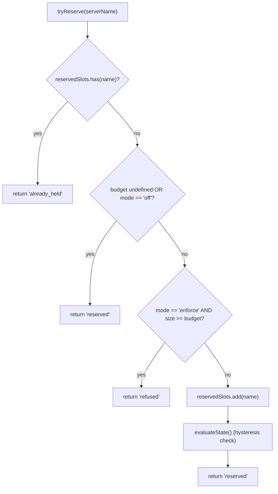
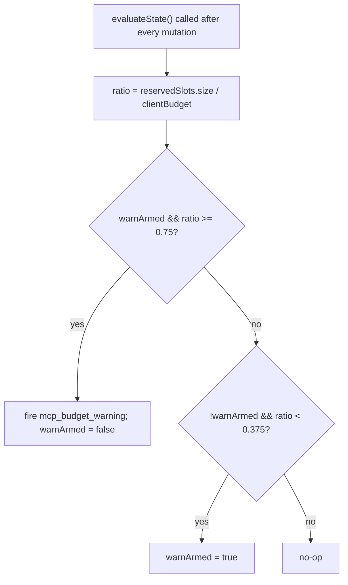

# MCP Workspace Budget Guardrails

## Overview

`WorkspaceMcpBudget` (`packages/core/src/tools/mcp-workspace-budget.ts`) is the workspace-scoped MCP client budget controller from F2 (#4175 commit 6). It owns the same state machine `McpClientManager` carries inline (slot reservation, 75% hysteresis warning, refused-batch coalescing across a `discoverAllMcpTools*` pass), but lives **once per workspace** inside `McpTransportPool` instead of once per session inside each ACP child's manager. The pool delegates `acquire` and `release` calls here so the cap applies to the **workspace**, not each session.

The legacy `McpClientManager` budget machinery stays for standalone qwen and SDK MCP servers (which bypass the pool per commit 4 fix). Pool mode → `WorkspaceMcpBudget` enforces; standalone / SDK MCP → manager's inline machinery enforces. No double counting because pool-mode discovery never calls the manager's `tryReserveSlot`.

## Responsibilities

- Track `reservedSlots: Set<string>` of currently-held server NAMES (slot key is per-NAME, matching PR 14 v1).
- `tryReserve(name) → 'reserved' | 'already_held' | 'refused'` — atomic and synchronous so concurrent `Promise.all` acquires cannot pass the cap at an await boundary.
- `release(name) → boolean` — idempotent (`Set.delete` semantics).
- Fire `mcp_budget_warning` once on upward 75% crossing of `reservedSlots.size / clientBudget`; re-arm only after a 37.5% downward crossing.
- Coalesce per-server refusals across a bulk discovery pass — `beginBulkPass()` / `endBulkPass()` brackets accumulate refusals into a single `mcp_child_refused_batch` event.
- Maintain `lastRefusedServerNames` for snapshot consumers (`GET /workspace/mcp`) — cleared at the START of the next bulk pass, NOT on emit, so a snapshot between passes still sees the last refusal set.

## Architecture

### Configuration

```ts
new WorkspaceMcpBudget({
  clientBudget?: number,           // undefined = unlimited
  mode: 'off' | 'warn' | 'enforce',
  onEvent?: (event: McpBudgetEvent) => void,
});
```

`mode` semantics:

- `off` — every method no-ops; `tryReserve` returns `'reserved'` unconditionally; no events fire.
- `warn` — slots are tracked and `mcp_budget_warning` fires at 75%, but `tryReserve` NEVER refuses.
- `enforce` — `tryReserve` refuses past `clientBudget`; `recordRefusal` queues per-server refusals; `endBulkPass` emits `mcp_child_refused_batch`.

### Constants from `mcp-client-manager.ts`

- `MCP_BUDGET_WARN_FRACTION = 0.75` — upward threshold.
- `MCP_BUDGET_REARM_FRACTION = 0.375` — downward hysteresis re-arm.
- `McpBudgetMode = 'off' | 'warn' | 'enforce'`.

### Internal state

| State                                              | Purpose                                                                                                      |
| -------------------------------------------------- | ------------------------------------------------------------------------------------------------------------ |
| `reservedSlots: Set<string>`                       | Authoritative reservation set; hysteresis evaluates `size / clientBudget`.                                   |
| `pendingRefusalNames: Set<string>`                 | Refusal names accumulated during the current `beginBulkPass`/`endBulkPass` window; drained on `endBulkPass`. |
| `pendingRefusalTransports: Map<string, transport>` | Sidecar so the emitted batch carries each refused server's transport.                                        |
| `lastRefusedServerNames: readonly string[]`        | Snapshot-visible refusal list from the most recent completed pass. Cleared at the start of the next pass.    |
| `warnArmed: boolean`                               | Hysteresis state — true = ready to fire, false = already fired since last 37.5% drain.                       |
| `bulkPassDepth: number`                            | Re-entrancy counter for nested bulk passes (nested passes must not double-emit).                             |

## Workflow

### `tryReserve`



`tryReserve` is **synchronous**. Pool's `acquire` is async, but reservation happens before any `await`, so two concurrent `Promise.all` acquires for different names cannot both pass the cap.

### Hysteresis



Hysteresis avoids repeated warnings when a workload oscillates around 75%. The first crossing fires; subsequent crossings without dropping to 37.5% do not.

### Refused-batch coalescing

```mermaid
sequenceDiagram
    autonumber
    participant POOL as pool.discoverAllMcpToolsViaPool
    participant BDG as WorkspaceMcpBudget
    participant EB as EventBus

    POOL->>BDG: beginBulkPass()
    BDG->>BDG: bulkPassDepth++<br/>clear lastRefusedServerNames if outermost
    loop per server in pass
        POOL->>BDG: tryReserve(name)
        alt refused
            POOL->>BDG: recordRefusal(name, transport)
            BDG->>BDG: pendingRefusalNames.add; pendingRefusalTransports.set
            Note over BDG: NO event yet (coalesce)
        end
    end
    POOL->>BDG: endBulkPass()
    BDG->>BDG: bulkPassDepth--
    alt outermost (depth == 0) AND pending non-empty
        BDG->>EB: emit mcp_child_refused_batch<br/>{refusedServers, budget, liveCount, reservedCount, mode: 'enforce', scope?: 'workspace'}
        BDG->>BDG: lastRefusedServerNames = drain pendingRefusalNames
    end
```

Out-of-pass refusals (e.g. lazy `readResource` spawn that bypasses the bulk pass entirely) emit length-1 batches inline for shape consistency. Nested passes (`bulkPassDepth > 0`) do not fire; only the outermost end-of-pass emits the coalesced batch.

## State & Lifecycle

- Budget controller is constructed once per workspace at pool init.
- `clientBudget` is immutable after construction; runtime changes require pool reconstruction.
- `mode` is also immutable (`onEvent` is stashed as `undefined` when `mode === 'off'` as defense in depth).
- `warnArmed` starts true; resets to true via the 37.5% downward crossing.
- `lastRefusedServerNames` is NOT cleared on `endBulkPass` emit — only at the START of the next bulk pass. This lets a snapshot route called between passes still report the last refusal set (otherwise dashboards would show empty refusals immediately after a refused-batch event was delivered).

## Dependencies

- `packages/core/src/tools/mcp-client-manager.ts` — re-uses `McpBudgetEvent`, `McpBudgetMode`, `McpRefusedServer`, `MCP_BUDGET_WARN_FRACTION`, `MCP_BUDGET_REARM_FRACTION`, `BudgetExhaustedError` (thrown by pool's `acquire` on refusal).
- `packages/core/src/tools/mcp-transport-pool.ts` — consumes the budget; passes events through to the daemon EventBus via the pool's `onEvent` plumbing.
- Daemon snapshot route `GET /workspace/mcp` — reads `getReservedSlots()`, `getRefusedServerNames()`, `getReservedCount()`, `getBudget()`, `getMode()`.

## Configuration

| Source          | Knob                                                                                     | Effect                                                                                       |
| --------------- | ---------------------------------------------------------------------------------------- | -------------------------------------------------------------------------------------------- |
| Flag            | `--mcp-client-budget=N`                                                                  | Sets `clientBudget` for the workspace controller.                                            |
| Flag            | `--mcp-budget-mode={off,warn,enforce}`                                                   | Sets `mode`. `enforce` requires a positive `clientBudget`; otherwise boot fails explicitly.  |
| Env             | `QWEN_SERVE_MCP_CLIENT_BUDGET`, `QWEN_SERVE_MCP_BUDGET_MODE`                             | Forwarded to ACP child via `childEnvOverrides`; child's `readBudgetFromEnv()` picks them up. |
| Capability tags | `mcp_guardrails` (always; `modes: ['warn', 'enforce']`), `mcp_guardrail_events` (always) | See [`11-capabilities-versioning.md`](./11-capabilities-versioning.md).                      |

## Caveats & Known Limits

- **Reservation key is per-NAME.** Two pool entries with the same server name but different fingerprints (e.g. sessions injecting divergent OAuth headers) consume ONE slot together. Subprocess accounting is exposed separately via the pool snapshot's `subprocessCount`. Operators should think of budget as "configured server slots" not "subprocess count".
- **Hysteresis triggers on reservation count, not live (CONNECTED) count.** Reservations include in-flight connects and survive transient disconnects, so hysteresis stays stable across reconnect cycles. Live count is exposed in event payloads as `liveCount` for SDK consumers that want that lens.
- **`warn` mode never refuses.** It still tracks reservations and fires `mcp_budget_warning`, but `tryReserve` always returns `'reserved'`. Refusal semantics are `enforce`-only.
- **Workspace-scoped budget events carry `scope: 'workspace'`** so they fan out to every attached session simultaneously. SDK reducers' `mcpBudgetWarningCount` / `mcpChildRefusedBatchCount` increment in lockstep across sessions on the same connection. Per-session legacy events from `McpClientManager` carry no `scope` (defaults to `'session'` semantically).
- **The kill switch `QWEN_SERVE_NO_MCP_POOL=1`** disables the pool entirely; the workspace budget is also disabled, and the per-session `McpClientManager` budget takes over. The capabilities envelope drops `mcp_workspace_pool` and `mcp_pool_restart` to report this accurately.
- **`ServeMcpBudgetStatusCell.scope` is a forward-compatible list shape.** Snapshot cells expose `budgets[]`, not a single `budget?` field. PR 14 v1 emits one `scope: 'session'` cell for each ACP session because `acpAgent.newSessionConfig()` constructs that session's `Config` / `McpClientManager`. The `'pool'` scope is reserved for the Wave 5 PR 23 pool-scoped cell that will sit alongside session-scoped cells. Consumers must tolerate additional unknown `scope` values by dropping them rather than failing.

## References

- `packages/core/src/tools/mcp-workspace-budget.ts` (entire class)
- `packages/core/src/tools/mcp-client-manager.ts` (`BudgetExhaustedError`, `McpBudgetEvent`, hysteresis constants)
- `packages/core/src/tools/mcp-transport-pool.ts` (pool's `acquire` site that calls `tryReserve`)
- F2 design document (v2.2): [`../../design/f2-mcp-transport-pool.md`](../../design/f2-mcp-transport-pool.md) §11 for workspace-level budget and the v2.2 changelog entries about budget and fingerprint follow-ups.
- F2 design notes: issue [#4175](https://github.com/turbospark/turbospark/issues/4175) commit 6.
