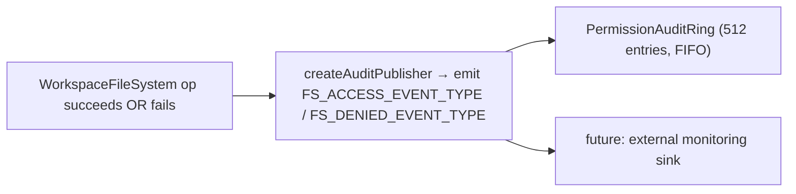

# Workspace File System Boundary

## Overview

The daemon never lets HTTP routes or ACP-side agent calls touch the host filesystem directly. Every read, write, list, glob, and stat goes through the `WorkspaceFileSystem` boundary (`packages/cli/src/serve/fs/`), which provides:

- **Path resolution** — canonicalize paths and reject anything escaping the bound workspace, including via symlinks.
- **Trust gating** — refuse writes when the workspace is not trusted (`untrusted_workspace`).
- **Size & content policy** — read cap (`MAX_READ_BYTES = 256 KiB`), write cap (`MAX_WRITE_BYTES = 5 MiB`), binary detection.
- **Atomicity** — write-then-rename with target mode preservation and `0o600` default for new files.
- **Audit** — every access / denial emits a structured event for `PermissionAuditRing` / monitoring.
- **Typed errors** — closed `FsErrorKind` union mapped to HTTP statuses.

The HTTP file routes (`GET /file`, `GET /file/bytes`, `POST /file/write`, `POST /file/edit`, `GET /list`, `GET /glob`, `GET /stat`) and the ACP-side `BridgeFileSystem` adapter (so agent-driven `readTextFile` / `writeTextFile` calls get the same gates) both go through this boundary.

## Responsibilities

- Resolve user-supplied paths into branded `ResolvedPath` values that the rest of the boundary can safely use.
- Refuse paths outside the bound workspace (`path_outside_workspace`) and paths whose target is a symlink (`symlink_escape`).
- Refuse reads above `MAX_READ_BYTES`, writes above `MAX_WRITE_BYTES`, and binary files (`binary_file`).
- Refuse writes/edits when the workspace is untrusted (`untrusted_workspace`) — gated by `assertTrustedForIntent(trusted, intent)`.
- Honor `.gitignore` / `.turbosparkignore` patterns via `shouldIgnore`.
- Perform atomic write-then-rename with target mode preservation; default new file mode is `0o600`.
- Emit `fs.access` / `fs.denied` audit events on every operation.
- Map every failure to a `FsError` with kind and HTTP status; route handlers serialize them uniformly.

## Architecture

### Module layout

| File                     | Purpose                                                                                                                                                                                                                                               |
| ------------------------ | ----------------------------------------------------------------------------------------------------------------------------------------------------------------------------------------------------------------------------------------------------- |
| `paths.ts`               | `canonicalizeWorkspace`, `resolveWithinWorkspace`, `hasSuspiciousPathPattern`, branded `ResolvedPath`, `Intent` union (`read \| write \| list \| stat \| glob`).                                                                                      |
| `policy.ts`              | `MAX_READ_BYTES`, `MAX_WRITE_BYTES`, `BINARY_PROBE_BYTES`, `assertTrustedForIntent`, `detectBinary`, `enforceReadBytesSize`, `enforceReadSize`, `enforceWriteSize`, `shouldIgnore`.                                                                   |
| `audit.ts`               | `FS_ACCESS_EVENT_TYPE`, `FS_DENIED_EVENT_TYPE`, `createAuditPublisher`, audit payload types.                                                                                                                                                          |
| `errors.ts`              | `FsError` class, `isFsError`, `FsErrorKind` union (14 kinds), `FsErrorStatus` union (`400 / 403 / 404 / 409 / 413 / 422 / 500 / 503`).                                                                                                                |
| `workspaceFileSystem.ts` | `createWorkspaceFileSystemFactory`, `WorkspaceFileSystem` (the orchestrator that reads/writes/lists), `WriteMode`, `ContentHash`, `FsEntry`, `FsStat`, `ListOptions`, `GlobOptions`, `ReadTextOptions`, `ReadBytesOptions`, `WriteTextAtomicOptions`. |

### `FsErrorKind` taxonomy

| Kind                     | Default HTTP | Meaning                                                                                                                                                                                       |
| ------------------------ | ------------ | --------------------------------------------------------------------------------------------------------------------------------------------------------------------------------------------- |
| `path_outside_workspace` | 400          | Resolved path is outside the bound workspace.                                                                                                                                                 |
| `symlink_escape`         | 400          | Target is a symlink (rejected per the conservative PR 18 + PR 20 posture).                                                                                                                    |
| `path_not_found`         | 404          | `ENOENT`.                                                                                                                                                                                     |
| `binary_file`            | 422          | Content sniffed binary on a text route.                                                                                                                                                       |
| `file_too_large`         | 413          | Above `MAX_READ_BYTES` or `MAX_WRITE_BYTES`.                                                                                                                                                  |
| `hash_mismatch`          | 409          | Optimistic-concurrency `expectedSha256` failed.                                                                                                                                               |
| `file_already_exists`    | 409          | `mode: 'create'` against an existing file.                                                                                                                                                    |
| `text_not_found`         | 422          | `POST /file/edit`'s search string wasn't in the file.                                                                                                                                         |
| `ambiguous_text_match`   | 422          | Multiple matches when exactly one was required.                                                                                                                                               |
| `untrusted_workspace`    | 403          | Write attempted in an untrusted workspace.                                                                                                                                                    |
| `permission_denied`      | 403          | OS-level `EACCES` / `EPERM`.                                                                                                                                                                  |
| `io_error`               | 503          | `ENOSPC` / `EIO` / `EBUSY` / `ETXTBSY` / `ENAMETOOLONG` / `EMFILE` / `ENFILE`. **Distinct from `permission_denied`** so monitoring pipelines do not page security responders for "disk full". |
| `internal_error`         | 500          | Non-errno error that reaches the boundary (`TypeError`, programmer bug).                                                                                                                      |
| `parse_error`            | 400 / 422    | Request-body parse error (400) or service-level invariant breach (422).                                                                                                                       |

### `BridgeFileSystem` (the ACP-side adapter)

`packages/acp-bridge/src/bridgeFileSystem.ts` defines:

```ts
interface BridgeFileSystem {
  readText(params: ReadTextFileRequest): Promise<ReadTextFileResponse>;
  writeText(params: WriteTextFileRequest): Promise<WriteTextFileResponse>;
}
```

This is the injection point for ACP `readTextFile` / `writeTextFile`. Bridge tests and Mode A embedded callers can omit it on `BridgeOptions`; `BridgeClient` falls back to its inline `fs.readFile` / `fs.writeFile` proxy (preserves pre-F1 behavior). Production `turbospark serve` wires `BridgeFileSystem` through `createBridgeFileSystemAdapter(fsFactory)` (`packages/cli/src/serve/bridgeFileSystemAdapter.ts`) so agent-side ACP writes pick up the same TOCTOU, symlink, trust-gate, and audit gates the HTTP routes use.

Two defensive gates the adapter MUST replicate (because the inline proxy is fully bypassed when the adapter is injected):

1. **Reject non-regular files** — sockets / pipes / char devices / procfs / sysfs entries can stream unbounded data despite `stats.size === 0`. The inline path throws with `describeStatKind(stats)` in the message.
2. **Cap buffered size** at `READ_FILE_SIZE_CAP = 100 MiB`. A tiny `{ line: 1, limit: 10 }` request against a 500 MB log would otherwise cost 500 MB of RSS just to return 10 lines.

The adapter goes further: it uses `WorkspaceFileSystem.writeTextOverwrite` (PR 18 primitive) for atomic temporary-file-and-rename writes with mode preservation, `0o600` default, and symlink rejection inside a per-path lock. This is a **divergence from the pre-F1 inline proxy** which resolved symlinks and wrote through to their target — agents that relied on writing through symlinked dotfiles now have to address the resolved path directly.

### FsError preservation over the ACP wire

When the `BridgeFileSystem` adapter throws an `FsError` (`kind: 'untrusted_workspace'` / `'symlink_escape'` / `'file_too_large'` / etc.), the ACP SDK's default RPC error path serializes only `error.message` as a generic `-32603 "Internal error"` — `kind` / `status` / `hint` are stripped. The downstream agent RPC client would then have to regex-match the human-readable message to dispatch typed UI (auth retry vs file picker vs proxy hint).

`BridgeClient.writeTextFile` and `BridgeClient.readTextFile` install a thin guard (`packages/acp-bridge/src/bridgeClient.ts`) that catches FsError-shaped throws and rethrows them as ACP `RequestError`:

```ts
function isFsErrorShape(err: unknown): err is FsErrorShape {
  return (
    err instanceof Error &&
    err.name === 'FsError' &&
    typeof (err as { kind?: unknown }).kind === 'string'
  );
}

function preserveFsErrorOverAcp(err: unknown): never {
  if (isFsErrorShape(err)) {
    throw new RequestError(-32603, err.message, {
      errorKind: err.kind,
      ...(err.hint !== undefined ? { hint: err.hint } : {}),
      ...(err.status !== undefined ? { status: err.status } : {}),
    });
  }
  throw err;
}
```

The agent's RPC client now receives `data.errorKind` (the closed `FsErrorKind` value) plus the optional `data.hint` and `data.status`, so SDK consumers branch on the typed enum instead of regex-matching the message.

Two design notes:

- **Duck typing over import** — `FsError` lives in `packages/cli/src/serve/fs/errors.ts` while `BridgeClient` lives in `packages/acp-bridge`. A direct `import { FsError }` would invert the dependency. The duck check (`name === 'FsError'` + `kind: string`) mirrors what `mapDomainErrorToErrorKind` (`status.ts`) already does for `TrustGateError` / `SkillError` for the same cross-package bundling reason.
- **JSON-RPC code stays at -32603** — the bridge cannot reliably map `FsError.kind` to a JSON-RPC error code shape, so the structured `data` field carries the semantic information for SDK consumers. The wire status code (`-32603` "internal error") is unchanged; clients route on `data.errorKind`.

### Trust gate

`assertTrustedForIntent(trusted, intent)` consumes the trust boolean injected by
the caller; the policy layer does not read `Config.isTrustedFolder()` directly.
Read / list / stat / glob are always allowed (trust is only for writes). Write
intents in untrusted workspaces throw
`FsError('untrusted_workspace', ..., status: 403)`. The trust signal flows in
via `WorkspaceFileSystemFactoryDeps.trusted: boolean` — `runTurbosparkServe` passes
`true` because the operator booted the daemon against a workspace they
implicitly trust; `createServeApp` (direct embed without `runTurbosparkServe`)
defaults to `false` and warns once per process (see
[`02-serve-runtime.md`](./02-serve-runtime.md)).

## Workflow

### Read

```mermaid
sequenceDiagram
    autonumber
    participant R as HTTP route OR BridgeFileSystem.readText
    participant FS as WorkspaceFileSystem
    participant POL as policy.ts
    participant FSP as node:fs

    R->>FS: readText(ctx, path, opts)
    FS->>FS: resolveWithinWorkspace(path) → ResolvedPath OR throw
    FS->>FSP: stat(path)
    FSP-->>FS: stats
    FS->>FS: reject if not regular file (describeStatKind)
    FS->>POL: enforceReadSize(stats.size, opts.maxBytes?)<br/>→ throw file_too_large OR slice plan
    FS->>FSP: readFile(path)
    FSP-->>FS: buffer
    FS->>POL: detectBinary(buffer)
    POL-->>FS: isBinary?
    FS->>FS: reject if binary; sha256 hash; truncate to line window
    FS->>FS: shouldIgnore? → annotate meta.matchedIgnore
    FS->>FS: audit fs.access
    FS-->>R: { content, sha256, truncated?, meta }
```

`readText` does not skip or reject reads because of ignore rules. It reads the
file normally and records the matching ignore classification in
`meta.matchedIgnore`. `list` and `glob` filter ignored results only when
`includeIgnored` is not enabled.

### Write

```mermaid
sequenceDiagram
    autonumber
    participant R as POST /file/write OR ACP writeText
    participant FS as WorkspaceFileSystem
    participant POL as policy.ts
    participant FSP as node:fs

    R->>FS: writeTextAtomic(ctx, path, content, opts)
    FS->>FS: assertTrustedForIntent(trusted, 'write') → throw untrusted_workspace OR ok
    FS->>FS: resolveWithinWorkspace(path)
    FS->>POL: enforceWriteSize(content) → throw file_too_large OR ok
    FS->>FSP: lstat(path) → reject symlink
    FS->>FS: acquire per-path lock
    FS->>FSP: stat(existing?) → capture target mode (default 0o600)
    FS->>FSP: writeFile(tmpPath, content, {mode})
    FS->>FSP: rename(tmpPath, path) (atomic)
    FS->>FS: audit fs.access (write)
    FS-->>R: { sha256, mode, bytesWritten }
```



The atomic write-then-rename ensures a SIGKILL / OOM mid-write does NOT leave the target truncated. `mode: 'create'` aborts with `file_already_exists` on lstat; `mode: 'overwrite'` proceeds; `expectedSha256` arms optimistic-concurrency (`hash_mismatch` on mismatch).

### `POST /file/edit` (single text replacement)

Adds two failure modes on top of write:

- `text_not_found` (422) — search string not in the file.
- `ambiguous_text_match` (422) — multiple matches when exactly one was required (the route's contract).

### Audit fan-out



`FS_ACCESS_EVENT_TYPE` / `FS_DENIED_EVENT_TYPE` carry context (`ctx`), path, intent, outcome, errorKind?, bytesRead/written, sha256?.

## State & Lifecycle

- The factory is built once at daemon boot (`runTurbosparkServe` → `resolveBridgeFsFactory` → adapter).
- Each request constructs a `RequestContext` and invokes the factory's orchestrator for that call only — no long-lived per-file state.
- Per-path locks live only for the duration of the write operation (no cross-call locking; concurrent writes to the same path race on the lock and serialize).
- Audit ring is owned by `runTurbosparkServe` and shared with the permission audit publisher.

## Dependencies

- `@turbospark/turbospark-core` — `Ignore`, `isBinaryFile`, `Config.isTrustedFolder()`.
- `node:fs`, `node:path`, `node:crypto`.
- `@turbospark/acp-bridge` — `BridgeFileSystem` contract on the ACP side.
- HTTP routes: `packages/cli/src/serve/routes/workspaceFileRead.ts`, `workspaceFileWrite.ts`.

## Configuration

| Source                                            | Knob                                                                  | Effect                                                                                                            |
| ------------------------------------------------- | --------------------------------------------------------------------- | ----------------------------------------------------------------------------------------------------------------- |
| `WorkspaceFileSystemFactoryDeps.trusted: boolean` | Constructor input                                                     | Whether writes are allowed; defaults to `true` from `runTurbosparkServe`, `false` from `createServeApp` (with warning). |
| Constant                                          | `MAX_READ_BYTES = 256 KiB`                                            | Read cap; `file_too_large` past this.                                                                             |
| Constant                                          | `MAX_WRITE_BYTES = 5 MiB`                                             | Write cap; sized below `express.json({ limit: '10mb' })`.                                                         |
| Constant                                          | `BINARY_PROBE_BYTES = 4096`                                           | Sample size for content-based binary detection.                                                                   |
| Capability tags                                   | `workspace_file_read`, `workspace_file_bytes`, `workspace_file_write` | See [`11-capabilities-versioning.md`](./11-capabilities-versioning.md).                                           |
| Workspace files                                   | `.gitignore`, `.turbosparkignore`                                           | Ignored paths surface as `ignored: true` from `shouldIgnore`.                                                     |

## Caveats & Known Limits

- **Symlinks are rejected, not followed.** This is a divergence from the pre-F1 inline `BridgeClient.writeTextFile` proxy which resolved symlinks. Agents writing through symlinked dotfiles need to address the resolved path directly.
- **`io_error` vs `permission_denied` are distinct.** Do not conflate them. Monitoring pipelines key on `errorKind` for alerting — folding ENOSPC into permission_denied would page security responders for `df -h` problems.
- **New file mode defaults to `0o600`, not umask defaults.** The write syscall's `mode` arg bypasses umask. Agents writing public files should explicitly pass a mode override.
- **`createServeApp` default `trusted: false`** silently rejects ACP writes with `untrusted_workspace` for embedders that do not inject a custom `fsFactory` or `bridge`. A one-time stderr warning fires the first time; further callers see no reminder. See [`02-serve-runtime.md`](./02-serve-runtime.md).
- **Read cap is enforced pre-decode.** A file at `MAX_READ_BYTES + 1` is refused even if the request only wants 10 lines — because the underlying `readFileWithLineAndLimit` reads the whole file into memory before slicing.
- **`BridgeFileSystem` adapter MUST replicate both inline-proxy gates** (non-regular-file refusal + buffered-size cap). The inline path is fully bypassed when the adapter is injected.

## References

- `packages/cli/src/serve/fs/index.ts` (barrel)
- `packages/cli/src/serve/fs/paths.ts`
- `packages/cli/src/serve/fs/policy.ts`
- `packages/cli/src/serve/fs/errors.ts`
- `packages/cli/src/serve/fs/audit.ts`
- `packages/cli/src/serve/fs/workspaceFileSystem.ts`
- `packages/cli/src/serve/bridgeFileSystemAdapter.ts`
- `packages/acp-bridge/src/bridgeFileSystem.ts`
- HTTP route reference: [`../turbospark-serve-protocol.md`](../turbospark-serve-protocol.md).
