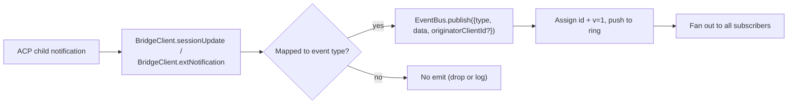
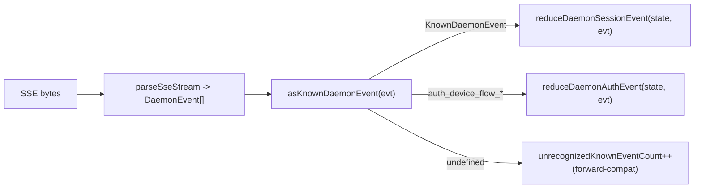

# Typed Daemon Event Schema v1

## Overview

Every SSE frame emitted by the daemon on `GET /session/:id/events` has the shape `{ id, v, type, data, originatorClientId?, _meta? }`. `v: 1` is the current `EVENT_SCHEMA_VERSION`. `type` comes from the closed, version-pinned `DAEMON_KNOWN_EVENT_TYPE_VALUES` set in `packages/sdk-typescript/src/daemon/events.ts`; the current set has 43 known event types. The envelope `_meta` field is stamped at the SSE write boundary by `formatSseFrame()` in `server.ts`; see [Envelope-level metadata](#envelope-level-metadata).

The SDK exposes `asKnownDaemonEvent(evt)`. It returns a discriminated `KnownDaemonEvent` for known event types and `undefined` for other types. SDK consumers can therefore handle forward compatibility without requiring a lockstep SDK upgrade when a newer daemon adds an event type; the session reducer records those as `unrecognizedKnownEventCount`.

The wire format lives in [`../turbospark-serve-protocol.md`](../turbospark-serve-protocol.md). This page is the payload contract for each event.

## Responsibilities

- Provide the single source of truth for the event vocabulary (`DAEMON_KNOWN_EVENT_TYPE_VALUES`).
- Provide a typed envelope for each event type (`DaemonEventEnvelope<TType, TData>`).
- Provide pure reducers (`reduceDaemonSessionEvent`, `reduceDaemonAuthEvent`) that project an event stream into SDK view state.
- Broadcast the `typed_event_schema` capability tag as an informational signal. If the tag is absent, `asKnownDaemonEvent` still falls back to `unknown`.

## Event vocabulary (43 known types)

Grouped by domain.

### Core session

| Type                       | Direction      | Trigger                                                                       | Key payload fields                                                               |
| -------------------------- | -------------- | ----------------------------------------------------------------------------- | -------------------------------------------------------------------------------- |
| `session_update`           | S->C           | Any ACP `sessionUpdate` notification: agent text, thought, tool call, or plan | `sessionUpdate: string, content?: ...` (opaque ACP shape)                        |
| `session_metadata_updated` | S->C           | `PATCH /session/:id/metadata`                                                 | `sessionId, displayName?`                                                        |
| `session_died`             | S->C terminal  | `channel.exited`                                                              | `sessionId, reason, exitCode? \| null, signalCode? \| null`                      |
| `session_closed`           | S->C terminal  | `DELETE /session/:id` or programmatic close                                   | `sessionId, reason: 'client_close' \| string, closedBy?`                         |
| `session_snapshot`         | S->C synthetic | Snapshot frame after SSE attach / replay                                      | `sessionId, currentModelId: string \| null, currentApprovalMode: string \| null` |

### Subscriber-level synthetic frames

| Type                    | Trigger                                                                                                                                                                                                                              | Notes                                                                                                                                                                                                                                                                                                                          |
| ----------------------- | ------------------------------------------------------------------------------------------------------------------------------------------------------------------------------------------------------------------------------------ | ------------------------------------------------------------------------------------------------------------------------------------------------------------------------------------------------------------------------------------------------------------------------------------------------------------------------------ |
| `client_evicted`        | Per-subscriber EventBus queue overflow. **No `id`**                                                                                                                                                                                  | `reason: string, droppedAfter?: number`; terminal only for the current subscriber, while the session remains alive.                                                                                                                                                                                                            |
| `slow_client_warning`   | Queue >= 75%; force-pushed and **has no `id`**                                                                                                                                                                                       | `queueSize, maxQueued, lastEventId`; re-armed after the queue drops below 37.5%.                                                                                                                                                                                                                                               |
| `stream_error`          | `SubscriberLimitExceededError` or another route stream error                                                                                                                                                                         | `error: string`; terminal for the subscription.                                                                                                                                                                                                                                                                                |
| `state_resync_required` | `subscribe({lastEventId})` detects that the daemon ring no longer holds `[lastEventId+1, earliestInRing-1]`, or the client cursor is from a previous bus epoch. Force-pushed **before** remaining replay frames and **has no `id`**. | `reason: 'ring_evicted' \| 'epoch_reset' \| string`, `lastDeliveredId: number`, `earliestAvailableId: number`. This is a recovery signal, not terminal: the SSE stream stays open and replay + live frames continue. The SDK reducer sets `awaitingResync = true` and skips deltas until the caller resets with `loadSession`. |
| `replay_complete`       | Id-less sentinel emitted after the `Last-Event-ID` replay loop finishes, for both clean replay and ring-evicted paths, even when `data.replayedCount === 0`. **No `id`**                                                             | `replayedCount: number`; lets consumers remove catch-up UI deterministically without a timeout.                                                                                                                                                                                                                                |

### Permissions (F3 + base)

| Type                          | Direction | Trigger                                            | Key payload fields                                                                                                                               |
| ----------------------------- | --------- | -------------------------------------------------- | ------------------------------------------------------------------------------------------------------------------------------------------------ |
| `permission_request`          | S->C      | Agent calls `requestPermission`                    | `requestId, sessionId, toolCall, options[]`; the envelope stamps `originatorClientId` from the prompt originator.                                |
| `permission_resolved`         | S->C      | Mediator has decided                               | `requestId, outcome` (ACP `PermissionOutcome`)                                                                                                   |
| `permission_already_resolved` | S->C      | Vote arrives after the request was already decided | `requestId, sessionId, outcome`                                                                                                                  |
| `permission_partial_vote`     | S->C      | `consensus` policy records a non-final vote        | `requestId, sessionId, votesReceived, votesNeeded (>= 1), quorum, optionTallies: Record<string, number>, originatorClientId?`                    |
| `permission_forbidden`        | S->C      | Policy rejects a vote                              | `requestId, sessionId, clientId?, reason: 'designated_mismatch' \| 'remote_not_allowed', originatorClientId?`; anonymous voters omit `clientId`. |

### Models

| Type                  | Direction | Payload                                      |
| --------------------- | --------- | -------------------------------------------- |
| `model_switched`      | S->C      | `sessionId, modelId`                         |
| `model_switch_failed` | S->C      | `sessionId, requestedModelId, error: string` |

### MCP guardrails (PR 14b + F2)

| Type                         | Direction | Payload                                                                                                                                                                                                                                                                                                                                                                                                                                           |
| ---------------------------- | --------- | ------------------------------------------------------------------------------------------------------------------------------------------------------------------------------------------------------------------------------------------------------------------------------------------------------------------------------------------------------------------------------------------------------------------------------------------------- |
| `mcp_budget_warning`         | S->C      | `liveCount, reservedCount, budget, thresholdRatio: 0.75, mode: 'warn' \| 'enforce', scope?: 'workspace' \| 'session'`                                                                                                                                                                                                                                                                                                                             |
| `mcp_child_refused_batch`    | S->C      | `refusedServers: [{ name, transport, reason: 'budget_exhausted' }], budget, liveCount, reservedCount, mode: 'enforce', scope?: 'workspace' \| 'session'`                                                                                                                                                                                                                                                                                          |
| `mcp_server_restarted`       | S->C      | `serverName, durationMs, entryIndex?` for F2 multi-entry pool restarts                                                                                                                                                                                                                                                                                                                                                                            |
| `mcp_server_restart_refused` | S->C      | `serverName, reason: 'budget_would_exceed' \| 'in_flight' \| 'disabled' \| 'restart_failed', entryIndex?, details?`. The fourth value, `restart_failed`, carries an underlying hard failure for pool-mode multi-entry restart. `MCP_RESTART_REFUSED_REASONS` rejects unknown reasons; an older SDK reducer silently drops additive new reason values because `parseDaemonEvent` returns `undefined`. Ship a new reason with an SDK that knows it. |

### Mutation control (Wave 4 PR 16+17)

| Type                    | Direction | Payload                                                                                              |
| ----------------------- | --------- | ---------------------------------------------------------------------------------------------------- |
| `memory_changed`        | S->C      | `scope: 'workspace' \| 'global', filePath, mode: 'append' \| 'replace', bytesWritten`                |
| `agent_changed`         | S->C      | `change: 'created' \| 'updated' \| 'deleted', name, level: 'project' \| 'user'`                      |
| `approval_mode_changed` | S->C      | `sessionId, previous, next, persisted: boolean`                                                      |
| `tool_toggled`          | S->C      | `toolName, enabled`; affects the next ACP child spawn and does not mutate already-running sessions.  |
| `settings_changed`      | S->C      | Workspace settings write completed. Payload is open; consumers should refresh with read-after-write. |
| `settings_reloaded`     | S->C      | Daemon workspace service reread settings. Payload is open.                                           |
| `workspace_initialized` | S->C      | `path, action: 'created' \| 'overwrote' \| 'noop', originatorClientId?`                              |

### Auth device flow (PR 21)

These events are workspace-keyed, not session-keyed. The session reducer treats them as no-ops; `reduceDaemonAuthEvent` projects them into workspace-level state.

| Type                          | Direction | Payload                                               |
| ----------------------------- | --------- | ----------------------------------------------------- |
| `auth_device_flow_started`    | S->C      | `deviceFlowId, providerId, expiresAt`                 |
| `auth_device_flow_throttled`  | S->C      | `deviceFlowId, intervalMs`                            |
| `auth_device_flow_authorized` | S->C      | `deviceFlowId, providerId, expiresAt?, accountAlias?` |
| `auth_device_flow_failed`     | S->C      | `deviceFlowId, errorKind, hint?`                      |
| `auth_device_flow_cancelled`  | S->C      | `deviceFlowId`                                        |

### MCP runtime mutation

| Type                 | Direction | Trigger                                                       | Key payload fields                                                           |
| -------------------- | --------- | ------------------------------------------------------------- | ---------------------------------------------------------------------------- |
| `mcp_server_added`   | S->C      | Server added at runtime through `POST /workspace/mcp/servers` | `name, transport, replaced, shadowedSettings, toolCount, originatorClientId` |
| `mcp_server_removed` | S->C      | Server removed at runtime                                     | `name, wasShadowingSettings, originatorClientId`                             |

### Turn lifecycle / assistant pushes

| Type                  | Direction | Trigger                                                                                                             | Key payload fields                                                                                                                                                                               |
| --------------------- | --------- | ------------------------------------------------------------------------------------------------------------------- | ------------------------------------------------------------------------------------------------------------------------------------------------------------------------------------------------ |
| `prompt_cancelled`    | S->C      | Prompt was cancelled through explicit `cancelSession` route **or** originator SSE disconnect                        | Envelope stamps `originatorClientId` for the canceling client. This means "cancellation requested", not "cancellation confirmed". Peer subscribers learn that the prompt has ended.              |
| `turn_complete`       | S->C      | A turn completed successfully                                                                                       | `sessionId, stopReason, promptId?`. `promptId` links to non-blocking prompt responses (`202`). The SDK matches SSE events to the originating prompt through it.                                  |
| `turn_error`          | S->C      | A turn failed                                                                                                       | `sessionId, message, code?, promptId?`; same `promptId` correlation mechanism.                                                                                                                   |
| `session_rewound`     | S->C      | `POST /session/:id/rewind` succeeded                                                                                | `sessionId, promptId, targetTurnIndex, filesChanged[], filesFailed[], originatorClientId?`                                                                                                       |
| `session_branched`    | S->C      | `POST /session/:id/branch` created a branch from an existing session                                                | `sourceSessionId, newSessionId, displayName, originatorClientId?`                                                                                                                                |
| `followup_suggestion` | S->C      | ACP child generated ghost-text follow-up suggestions after `end_turn`, forwarded over per-session SSE               | `sessionId, suggestion, promptId`; wire only carries suggestions whose `getFilterReason()===null`. Clients render them as input-placeholder ghost text and invalidate them on next `sendPrompt`. |
| `user_shell_command`  | S->C      | User started a shell command through `POST /session/:id/shell`; fanned out to other subscribers in the same session | `sessionId, command, shellId, originatorClientId?`. There is no typed `DaemonXxxData` interface yet; `asKnownDaemonEvent` returns `undefined` and the UI normalizer parses it ad hoc.            |
| `user_shell_result`   | S->C      | Result of the shell command above                                                                                   | `sessionId, shellId, exitCode, output, aborted`. Same ad hoc parsing note as `user_shell_command`.                                                                                               |

## Architecture

| Concern                                | Source                                         | Notes                                                                                                              |
| -------------------------------------- | ---------------------------------------------- | ------------------------------------------------------------------------------------------------------------------ |
| `EVENT_SCHEMA_VERSION = 1`             | `packages/acp-bridge/src/eventBus.ts`          | Sent on every frame.                                                                                               |
| `DAEMON_KNOWN_EVENT_TYPE_VALUES`       | `packages/sdk-typescript/src/daemon/events.ts` | Closed list with 43 types.                                                                                         |
| `DaemonEventEnvelope<TType, TData>`    | `events.ts`                                    | Generic envelope.                                                                                                  |
| `DaemonKnownEventType`                 | `events.ts`                                    | `typeof DAEMON_KNOWN_EVENT_TYPE_VALUES[number]`.                                                                   |
| Per-event payload types                | `events.ts`                                    | Most event types have a `DaemonXxxData` interface; `user_shell_*` is currently parsed ad hoc by the UI normalizer. |
| `asKnownDaemonEvent(evt)`              | `events.ts`                                    | Returns `KnownDaemonEvent \| undefined`.                                                                           |
| `reduceDaemonSessionEvent(state, evt)` | `events.ts`                                    | Projects into `DaemonSessionViewState`.                                                                            |
| `reduceDaemonAuthEvent(state, evt)`    | `events.ts`                                    | Projects into `DaemonAuthState`.                                                                                   |
| `isWorkspaceScopedBudgetEvent(evt)`    | `events.ts`                                    | Detects F2 `scope: 'workspace'`.                                                                                   |

### `DaemonSessionViewState`

`reduceDaemonSessionEvent` fills this view state. CLI TUI adapter, `DaemonChannelBridge`, and VS Code IDE consume it. Key fields:

- `alive: boolean` - becomes `false` after a terminal frame (`session_died`, `session_closed`, `client_evicted`, `stream_error`).
- `currentModelId?: string` - from `model_switched`.
- `displayName?: string` - from `session_metadata_updated`.
- `pendingPermissions: Record<string, DaemonPermissionRequestData>` - open requests keyed by `requestId`; cleared by `permission_resolved` / `permission_already_resolved`.
- `lastSessionUpdate?: DaemonSessionUpdateData` - latest `session_update`.
- `lastModelSwitchFailure?: DaemonModelSwitchFailedData` - from `model_switch_failed`.
- `terminalEvent?` - raw terminal event.
- `streamError?: DaemonStreamErrorData` - latest `stream_error` payload.
- `unrecognizedKnownEventCount`, `lastUnrecognizedKnownEvent?` - event was recognized by `asKnownDaemonEvent` but the reducer has no dedicated state for it yet.
- `droppedPermissionRequestCount`, `lastDroppedPermissionRequestId?` - malformed permission request could not enter the pending map.
- `unmatchedPermissionResolutionCount`, `lastUnmatchedPermissionResolutionId?` - permission resolution had no matching pending request.
- `slowClientWarningCount`, `lastSlowClientWarning?` - from `slow_client_warning`.
- `mcpBudgetWarningCount`, `lastMcpBudgetWarning?` - from `mcp_budget_warning`.
- `mcpChildRefusedBatchCount`, `lastMcpChildRefusedBatch?` - from `mcp_child_refused_batch`.
- `lastWorkspaceMutation?`, `lastWorkspaceMutationType?` - from `memory_changed` / `agent_changed`.
- `approvalMode?`, `approvalModeChangedCount`, `lastApprovalModeChange?` - from `approval_mode_changed`.
- `toolToggleCount`, `lastToolToggle?` - from `tool_toggled`.
- `workspaceInitCount`, `lastWorkspaceInit?` - from `workspace_initialized`.
- `mcpRestartCount`, `lastMcpRestart?` - from `mcp_server_restarted`.
- `mcpRestartRefusedCount`, `lastMcpRestartRefused?` - from `mcp_server_restart_refused`.
- `settings_changed` / `settings_reloaded` - recognized by `asKnownDaemonEvent`; the session reducer does not maintain dedicated view-state fields, and UIs usually treat them as refresh signals.
- `permissionVoteProgress: Record<string, DaemonPermissionPartialVoteData>` - consensus voting progress.
- `forbiddenVotes: DaemonPermissionForbiddenData[]`, `forbiddenVoteCount` - policy-rejected vote records, capped at 32.
- `awaitingResync: boolean` - set by `state_resync_required`; cleared when consumer resets view state.
- `resyncRequiredCount`, `lastResyncRequired?` - resync observability.
- `lastFollowupSuggestion?: DaemonFollowupSuggestionData` - latest follow-up suggestion pushed by daemon.
- `lastTurnComplete?: DaemonTurnCompleteData` - latest successful turn completion.
- `lastTurnError?: DaemonTurnErrorData` - latest turn error.
- `rewindCount`, `lastRewind?`, `lastBranch?` - latest rewind / branch events.

### `DaemonAuthState`

One entry per `providerId`, driven by `auth_device_flow_*`. Each flow exposes `{ deviceFlowId, status, providerId, expiresAt?, lastThrottleIntervalMs?, lastError? }`.

## Flow

### Producer side



### Consumer side (SDK)



## Envelope-level metadata

Beyond each event's `data` payload, the daemon stamps two envelope-level fields.

### `_meta.serverTimestamp` - daemon clock

`formatSseFrame()` in `packages/cli/src/serve/server.ts` stamps this at the SSE write boundary, **not** inside `EventBus.publish`. The in-memory `BridgeEvent` type stays unchanged; internal daemon consumers do not see `_meta`, while wire SSE frames do.

```jsonc
{
  "id": 47,
  "v": 1,
  "type": "session_update",
  "data": { ... },
  "_meta": { "serverTimestamp": 1716287345123 }
}
```

The merge preserves any existing `_meta` keys
(`{...existingMeta, serverTimestamp: Date.now()}`). **No current daemon producer
writes envelope-level `_meta`**. The top-level merge is a forward-compatibility
escape hatch.

Why it matters: multi-client UIs that render relative time or sort transcript blocks should use server time instead of each browser/tab/phone local clock. Server stamping keeps ordering consistent across clients.

SDK access: prefer `event._meta?.serverTimestamp`. Compatibility paths may also probe `event.serverTimestamp` or `event.data._meta.serverTimestamp`. Do not mix ACP payload `data._meta` with daemon envelope `_meta`.

### `originatorClientId`

Events triggered by a request that carried a registered `X-Qwen-Client-Id` may stamp this field. See [`08-session-lifecycle.md`](./08-session-lifecycle.md).

## Tool-call `_meta` (provenance / serverId)

This is separate from envelope `_meta`: ACP `session/update` payloads can carry their own `_meta` in `event.data._meta`. `ToolCallEmitter` (`packages/cli/src/acp-integration/session/emitters/ToolCallEmitter.ts`) stamps two fields on `emitStart`, `emitResult`, and `emitError`:

| Field        | Type                                      | Resolution rule                                                                                                                                                            |
| ------------ | ----------------------------------------- | -------------------------------------------------------------------------------------------------------------------------------------------------------------------------- |
| `provenance` | `'builtin' \| 'mcp' \| 'subagent'`        | `ToolCallEmitter.resolveToolProvenance`: `subagentMeta` wins with `subagent`; tool name matching `mcp__<server>__<tool>` maps to `mcp`; everything else maps to `builtin`. |
| `serverId`   | `string` only when `provenance === 'mcp'` | Extracted heuristically from `mcp__<serverId>__<tool>`.                                                                                                                    |

The existing `_meta.toolName` display name is preserved. UI uses these fields to render builtin / MCP server / subagent badges without reparsing the tool name.

## SDK reducer behavior

`reduceDaemonSessionEvent(state, evt)` in `packages/sdk-typescript/src/daemon/events.ts` projects the stream into `DaemonSessionViewState`. The resync-related fields are:

- **`awaitingResync: boolean`** - set by `state_resync_required`; caller clears it, typically after `POST /session/:id/load` resets view state.
- **`resyncRequiredCount: number`** - observability counter.
- **`lastResyncRequired?: DaemonStateResyncRequiredData`** - latest payload.

While `awaitingResync = true`, the reducer **skips delta application** and only allows the closed `RESYNC_PASSTHROUGH_TYPES` set:

| Passthrough type        | Why it is still applied during resync                                          |
| ----------------------- | ------------------------------------------------------------------------------ |
| `state_resync_required` | Rare second resync should update `lastResyncRequired` / `resyncRequiredCount`. |
| `session_died`          | Terminal stream signal must remain visible during resync.                      |
| `session_closed`        | Same as above.                                                                 |
| `client_evicted`        | Same as above.                                                                 |
| `stream_error`          | Same as above.                                                                 |
| `session_snapshot`      | Full-state authoritative frame; safe to apply during resync.                   |

`lastEventId` still advances monotonically through `advanceLastEventId(base)` during resync. After the caller resets and clears `awaitingResync`, subsequent deltas align to the correct cursor.

`reduceDaemonAuthEvent` projects device-flow events into workspace-level auth
state entries shaped like
`{deviceFlowId, status, providerId, expiresAt?, lastThrottleIntervalMs?, lastError?}`
conceptually. In code the reducer stores `status`, `errorKind`, `hint`,
`intervalMs`, `lastSeenEventId`, `authorizedExpiresAt`, and `accountAlias` on
`DaemonDeviceFlowReducerState`; the daemon event payloads themselves remain the
per-event shapes listed above.

## State and forward compatibility

- Add a known event type by appending to `DAEMON_KNOWN_EVENT_TYPE_VALUES`. Old SDKs return `undefined` for unrecognized event types through the fallback path and increment `unrecognizedKnownEventCount`; new SDKs rely on the discriminated union.
- Adding optional fields to an existing payload is safe because payloads are open (`{ [key: string]: unknown }`).
- Changing an existing payload **shape** is breaking and must bump `EVENT_SCHEMA_VERSION` plus advertise a compatible capability tag such as `caps.features.typed_event_schema_v2`.
- `id` is per-session monotonic. Subscriber-level synthetic frames (`client_evicted`, `slow_client_warning`, `stream_error`, `state_resync_required`, `replay_complete`, `session_snapshot`) intentionally have no id so other subscribers do not see gaps.
- `originatorClientId` lives on the envelope rather than `data`. F3 partial-vote / forbidden payloads also merge it into `data` through `mergeOriginator` so view-state consumers do not need to retain the envelope.

## Dependencies

- [`10-event-bus.md`](./10-event-bus.md) - delivery channel.
- [`11-capabilities-versioning.md`](./11-capabilities-versioning.md) - how SDKs preflight `typed_event_schema`, `mcp_guardrail_events`, and `permission_mediation`.
- [`04-permission-mediation.md`](./04-permission-mediation.md) - how permission events are produced.
- [`13-sdk-daemon-client.md`](./13-sdk-daemon-client.md) - `asKnownDaemonEvent`, reducers, and view-state shape.

## Configuration

- Always advertised: `typed_event_schema`, `mcp_guardrail_events`, and `permission_mediation` (with supported policy modes).
- No env var or flag directly controls the schema itself. `QWEN_SERVE_NO_MCP_POOL=1` changes MCP event `scope` from `'workspace'` to absent or `'session'`.

## Caveats and known limits

- Six synthetic frame types intentionally have no `id`; SDK code must not assume every event has an id.
- `permission_partial_vote` only appears under `consensus`. `permission_forbidden` appears under `designated`, `consensus`, and `local-only`, but not under `first-responder`.
- `mcp_child_refused_batch` only appears in `mode: 'enforce'`; `warn` mode never refuses.
- `auth_device_flow_*` events are not session-keyed. When consuming through `DaemonSessionClient`, use `reduceDaemonAuthEvent` for them rather than the session reducer.

## References

- `packages/sdk-typescript/src/daemon/events.ts`
- `packages/acp-bridge/src/eventBus.ts` (`EVENT_SCHEMA_VERSION`)
- `packages/cli/src/serve/capabilities.ts` (`typed_event_schema`, `mcp_guardrail_events`, `permission_mediation`)
- Wire reference: [`../turbospark-serve-protocol.md`](../turbospark-serve-protocol.md)
