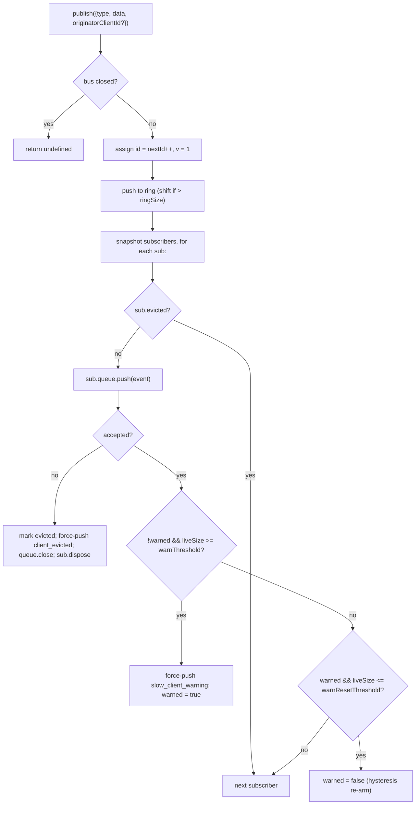

# SSE Event Bus & Backpressure

## Overview

`EventBus` (`packages/acp-bridge/src/eventBus.ts`) is the per-session in-memory pub/sub that feeds the daemon's `GET /session/:id/events` SSE route. It assigns each event a monotonic id, buffers recent events in a bounded ring for `Last-Event-ID` replay, fans published events out to all subscribers, applies per-subscriber backpressure (warning at 75% queue fill, eviction at the cap), and emits two synthetic terminal frames (`client_evicted`, `slow_client_warning`) that the SDK treats as first-class events but the bus marks **without an `id`** so they do not consume a slot in the per-session sequence.

`EventBus` is currently package-private to `acp-bridge` and consumed by the bridge factory through one closed-over instance per session. A future refactor (called out at line 150–159 of `eventBus.ts`) will lift it to a top-level building block so channels, dual-output, and future WebSocket transports can subscribe through the same bus instead of running parallel streams.

## Responsibilities

- Assign per-session monotonic event ids starting at 1.
- Buffer the last `ringSize` events for replay on subscribe-with-`lastEventId`.
- Fan published events out to ≤ `maxSubscribers` concurrent subscribers.
- Apply per-subscriber bounded queues; drop overflowing subscribers with a synthetic `client_evicted` terminal frame.
- Emit `slow_client_warning` once per overflow episode at 75% queue fill, with 37.5% hysteresis to prevent repeated warnings.
- Tear subscriptions down promptly on `AbortSignal.abort()`.
- Cleanly close every subscriber on bus close (e.g. session teardown).
- Never throw from `publish` (the contract is "publish is always safe to call").

## Architecture

| Constant                               | Value       | Purpose                                                                                            |
| -------------------------------------- | ----------- | -------------------------------------------------------------------------------------------------- |
| `EVENT_SCHEMA_VERSION`                 | `1`         | Stamped on every `BridgeEvent.v`; bumped on breaking frame changes.                                |
| `DEFAULT_RING_SIZE`                    | `8000`      | Per-session replay ring. Operator override via `--event-ring-size`.                                |
| `DEFAULT_MAX_QUEUED`                   | `256`       | Per-subscriber backlog cap.                                                                        |
| `DEFAULT_MAX_SUBSCRIBERS`              | `64`        | Per-session subscriber cap.                                                                        |
| `WARN_THRESHOLD_RATIO`                 | `0.75`      | `slow_client_warning` trigger fraction of `maxQueued`.                                             |
| `WARN_RESET_RATIO`                     | `0.375`     | Hysteresis re-arm fraction.                                                                        |
| `MAX_EVENT_RING_SIZE` (in `bridge.ts`) | `1_000_000` | Soft upper bound on `BridgeOptions.eventRingSize` to catch out-of-memory failures caused by typos. |

### `BridgeEvent`

```ts
interface BridgeEvent {
  id?: number; // monotonic per session; absent on synthetic terminal frames
  v: 1; // EVENT_SCHEMA_VERSION
  type: string; // one of the 43 known types or future-extensible
  data: unknown; // payload (typed per-type by the SDK; see 09-event-schema.md)
  originatorClientId?: string; // set when the event derives from a clientId-stamped request
}
```

### `SubscribeOptions`

```ts
interface SubscribeOptions {
  lastEventId?: number; // replay from after this id (Last-Event-ID resume)
  signal?: AbortSignal; // aborts the subscription promptly
  maxQueued?: number; // per-subscriber backlog cap; default 256
}
```

`subscribe()` returns an `AsyncIterable<BridgeEvent>`. The SSE route consumes it with `for await`. Registration is **synchronous** — by the time `subscribe()` returns, the subscriber is already attached, so a `publish()` that races with the consumer's first `next()` is still delivered.

### `BoundedAsyncQueue`

The per-subscriber queue. Two pivotal behaviors:

- **Live cap is on live items only.** Items inserted via `forcePush()` carry a `forced: true` tag per entry and never count toward `maxSize`. This lets the `Last-Event-ID` replay path force-push hundreds of historical frames into a fresh subscriber without immediately tripping the live cap and evicting the just-resumed subscriber.
- **`liveCount` is maintained as a field**, not derived from `forcedInBuf` position. The earlier position-based heuristic broke when `slow_client_warning` started force-pushing mid-stream (warnings go to the BACK of the queue, not the front like replays). Per-entry `forced` tags are position-independent.

`push(value)` returns `false` (instead of blocking or throwing) when the live backlog is at the cap — the bus uses that signal to evict the subscriber. `forcePush(value)` bypasses the cap. `close({drain?: boolean})` drains pending items by default; abort-path passes `drain: false` to drop them immediately.

## Workflow

### Publish



`publish` never throws. Closing the bus mid-publish (the shutdown path closes per-session buses before awaiting `channel.kill()`) returns `undefined` rather than throwing because the agent may still emit `sessionUpdate` notifications in the small window between bus close and channel kill.

### Subscribe + replay (with ring-eviction detection)

```mermaid
sequenceDiagram
    autonumber
    participant SR as SSE route
    participant EB as EventBus
    participant Q as BoundedAsyncQueue

    SR->>EB: subscribe({lastEventId: 42, maxQueued: 256, signal})
    EB->>EB: refuse if subs.size >= maxSubscribers<br/>(throws SubscriberLimitExceededError)
    EB->>Q: new BoundedAsyncQueue(256)
    EB->>EB: subs.add(sub)
    EB->>EB: epochReset = lastEventId >= nextId
    alt epochReset (old bus epoch)
        EB->>Q: forcePush state_resync_required<br/>{ reason: 'epoch_reset', lastDeliveredId: 42, earliestAvailableId: ring[0]?.id ?? nextId }
        Note over EB,Q: id-less synthetic, frame goes BEFORE replay.<br/>Replay scans the whole current ring.
    else same bus epoch
        EB->>EB: earliestInRing = ring[0]?.id
        opt earliestInRing > lastEventId + 1 (gap evicted)
            EB->>Q: forcePush state_resync_required<br/>{ reason: 'ring_evicted', lastDeliveredId: 42, earliestAvailableId: earliestInRing }
            Note over EB,Q: id-less synthetic, frame goes BEFORE replay.<br/>Stream stays open; SDK reducer flips awaitingResync.
        end
    end
    loop ring scan
        EB->>EB: for e in ring where e.id > (epochReset ? 0 : 42)
        EB->>Q: forcePush(e)
    end
    EB->>EB: attach AbortSignal listener<br/>(onAbort → queue.close({drain:false}); dispose)
    EB-->>SR: AsyncIterable
    SR->>Q: next() in for-await loop
```

If `subs.size >= maxSubscribers` at subscribe time, `SubscriberLimitExceededError` is thrown — the SSE route catches it and serializes a `stream_error` synthetic frame to the rejected client so they do not see a silent empty stream. Returning an empty iterable instead would leave operators without visibility into "some clients get events, some do not" under load.

### Ring-eviction → `state_resync_required` (the recovery flow)

When a consumer reconnects with `Last-Event-ID: N` and the ring's earliest surviving event has `id > N + 1`, the events in `[N+1, earliestInRing-1]` were evicted before the consumer reconnected. The naïve replay would silently succeed with a non-contiguous suffix, the SDK reducer would keep applying deltas as if the stream were contiguous, and its state would diverge from the daemon's truth — with no terminal signal.

Implemented in `EventBus.subscribe()`:

1. First check `opts.lastEventId >= this.nextId`. If true, the client cursor is
   from an older bus epoch (daemon restart / EventBus reconstruction), so the
   bus emits `reason: 'epoch_reset'` and replays the whole current ring.
2. Otherwise compute `earliestInRing = this.ring[0]?.id`.
3. If `earliestInRing > opts.lastEventId + 1`, force-push a synthetic frame **before** the replay frames:
   ```jsonc
   {
     "v": 1,
     "type": "state_resync_required",
     "data": {
       "reason": "ring_evicted",
       "lastDeliveredId": <opts.lastEventId>,
       "earliestAvailableId": <earliestInRing>
     }
   }
   ```
4. Continue the normal replay loop afterwards.

Critical contracts (and what the #4360 review corrected):

- **No `id`** — same no-slot pattern as `client_evicted`, so it does not occupy a slot in the per-session monotonic sequence other subscribers observe.
- **Stream stays open** — unlike `client_evicted` (genuinely terminal), `state_resync_required` is recovery-oriented. Replay + live frames continue flowing afterward.
- **Reducer auto-skips deltas** — the SDK side flips `awaitingResync = true` and applies only `state_resync_required`, the terminal frames, and full-state snapshots until consumer code calls `loadSession` and clears the flag. See [`09-event-schema.md`](./09-event-schema.md) for `RESYNC_PASSTHROUGH_TYPES`.
- **Network-friendly** — frames stay on the wire so the SDK can compute a "what you missed" diff later if it wants to. No extra reconnect cycle is required.

### Eviction terminal flow

When a subscriber's live backlog has been at `maxQueued` and the next `push()` returns `false`:

1. Mark `sub.evicted = true`.
2. Construct `client_evicted` frame **without `id`** — `{ v: 1, type: 'client_evicted', data: { reason: 'queue_overflow', droppedAfter: <last delivered id> } }`.
3. `queue.forcePush(evictionFrame)` so the consumer iterator sees one terminal frame.
4. `queue.close()` so iteration unwinds after the terminal frame.
5. Call `sub.dispose()` — removes from `subs` and detaches the `AbortSignal` listener; without this cleanup, stalled consumers' closures remain live until `AbortSignal` garbage collection.

### Abort flow

`AbortSignal.abort()` → `onAbort()`:

1. `queue.close({drain: false})` — drop buffered items so the SSE route does not keep serializing events to a socket nobody is listening to.
2. `dispose()` — idempotent through a `disposed` flag.

Already-aborted signals at subscribe time call `onAbort()` synchronously before returning the iterator.

## State & Lifecycle

- `nextId` starts at 1 and only ever increments. `lastEventId` getter returns `nextId - 1`.
- `ring` is bounded; eviction-by-shift is O(n) once full. At `ringSize=8000` that measures in low milliseconds on high-volume sessions — well below per-frame latency budget. A circular-buffer refactor is deferred until profiling flags it or operators increase `--event-ring-size` by an order of magnitude.
- `close()` flips `closed`, closes every subscriber's queue, and clears `subs`. Subsequent `publish()` / `subscribe()` are no-ops (`publish` returns undefined; `subscribe` returns `emptyAsyncIterable`).
- Each session owns one `EventBus`. Bus close happens before `channel.kill()` so in-flight publishes during shutdown return undefined rather than throwing.

## Dependencies

- Consumed by `packages/acp-bridge/src/bridge.ts` (`BridgeClient.sessionUpdate` / `BridgeClient.extNotification` → `events.publish(...)`).
- Consumed by `packages/cli/src/serve/server.ts` (SSE route handler → `events.subscribe(...)` then formats `BridgeEvent` to SSE wire frames).
- Re-export shim: `packages/cli/src/serve/eventBus.ts` → `@turbospark/acp-bridge/eventBus`.
- SDK consumer: `packages/sdk-typescript/src/daemon/sse.ts` (`parseSseStream`), then `asKnownDaemonEvent` (see [`09-event-schema.md`](./09-event-schema.md), [`13-sdk-daemon-client.md`](./13-sdk-daemon-client.md)).

## Configuration

- `--event-ring-size <n>` — per-session ring depth; soft-capped at `MAX_EVENT_RING_SIZE = 1_000_000`.
- Subscriber `?maxQueued=N` query parameter on `GET /session/:id/events`, range `[16, 2048]`. SDK clients pre-flight `caps.features.slow_client_warning` before opting in.
- `BridgeOptions.eventRingSize` (overrides daemon default for embedded usage).
- Capability tags: `session_events`, `slow_client_warning`, `typed_event_schema`.

## Caveats & Known Limits

- **Synthetic frames have no `id`.** SDK consumers using `Last-Event-ID` resume only record frames with ids; `slow_client_warning`, `client_evicted`, `state_resync_required`, and `replay_complete` do not advance the cursor and do not consume per-session sequence numbers. If two id-bearing live frames have a real gap, handle it through the ring-eviction / epoch-reset resync path rather than treating it as a private synthetic frame.
- `client_evicted` is **per-subscriber**, not per-session. The same client can reconnect.
- `BoundedAsyncQueue` iterator is **not safe for concurrent drivers** — two simultaneous `.next()` calls would race for the same event. Daemon usage is sequential (`for await ... of` in the SSE route handler), so this is safe in production.
- The bus is currently package-private; channels and the web UI must subscribe through the daemon's HTTP SSE route, not by reaching into the bus directly. Stage 1.5 will lift this.

## References

- `packages/acp-bridge/src/eventBus.ts` (entire file)
- `packages/acp-bridge/src/bridge.ts` (publish sites, esp. `BridgeClient.sessionUpdate` and the F3 permission events)
- `packages/cli/src/serve/server.ts` (SSE route handler — formats `BridgeEvent` to wire SSE)
- `packages/sdk-typescript/src/daemon/sse.ts` (SSE wire parser on the client side)
- Wire reference: [`../turbospark-serve-protocol.md`](../turbospark-serve-protocol.md) (the `Last-Event-ID` reconnect contract).
