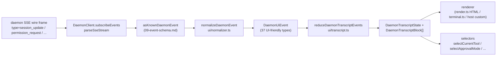

# Shared UI Transcript Layer

> **Current status**: `packages/cli/src/ui/daemon/DaemonTuiAdapter.ts` is still present on `main` as a legacy experimental CLI-side adapter. This document describes the newer SDK-side shared UI transcript layer: reusable daemon event normalization and transcript primitives that any UI host can consume, including Web, TUI, IDE, and IM channels. CLI TUI, channel, and VS Code IDE migrations are follow-up work.

## Overview

`packages/sdk-typescript/src/daemon/ui/` adds a `ui/*` subpackage to the SDK. It turns the daemon SSE event stream into UI-renderable transcript blocks through reusable primitives:

- **Normalization** (`normalizer.ts`): maps the daemon wire schema's 43 known event types (see [`09-event-schema.md`](./09-event-schema.md)) into 37 UI-friendly `DaemonUiEventType` semantic events such as `assistant.text.delta`, `tool.update`, and `session.metadata.changed`.
- **State machine** (`transcript.ts`, `store.ts`): pure reducer plus subscribable store that projects UI events into an ordered `DaemonTranscriptBlock[]`.
- **Renderers** (`render.ts`, `terminal.ts`, `toolPreview.ts`): transcript blocks to HTML, terminal text, and tool preview strings. Hosts can use or replace them.
- **Conformance** (`conformance.ts`): cross-host consistency tests used when channel, TUI, and IDE surfaces migrate to these primitives.

The first production consumer is **`packages/webui/src/daemon/`** ([#4328](https://github.com/turbospark/turbospark/pull/4328)). Its React `DaemonSessionProvider` and transcript adapter let the web UI connect directly to daemon HTTP+SSE instead of only rendering host `postMessage` traffic. CLI TUI, channel base, and VS Code IDE can reuse the same layer later; [`../daemon-ui/MIGRATION.md`](../daemon-ui/MIGRATION.md) documents the v2 incremental migration guide.

## Responsibilities

- Normalize the 43 daemon wire events into a stable UI vocabulary (`DaemonUiEventType`) so renderers do not inspect `rawEvent.data`.
- Keep daemon-monotonic SSE `eventId` as the **primary ordering key** so different clients render transcripts in the same order.
- Use a pure reducer to produce transcript blocks, with selectors for pending permissions, current tool, approval mode, tool progress, and subagent children.
- Provide baseline HTML and terminal renderers while allowing host-specific rendering.
- Expose public constants such as `DAEMON_PLAN_TOOL_CALL_ID` for plan panels.
- Preserve additive wire compatibility: unknown event types normalize to `debug` instead of being dropped.

## Architecture

### Package structure

| File                                             | Exports                                                                                                                                                           | Purpose                     |
| ------------------------------------------------ | ----------------------------------------------------------------------------------------------------------------------------------------------------------------- | --------------------------- |
| `packages/sdk-typescript/src/daemon/ui/index.ts` | Subpackage barrel                                                                                                                                                 | Public entry point          |
| `ui/types.ts`                                    | `DaemonUiEventType`, per-type `DaemonUiEvent*` interfaces, `DaemonTranscriptBlock`, `DaemonTranscriptState`, `DaemonUiToolProvenance`, `DAEMON_PLAN_TOOL_CALL_ID` | Types                       |
| `ui/normalizer.ts`                               | `normalizeDaemonEvent(evt) -> DaemonUiEvent`, `getSessionUpdatePayload(evt)`                                                                                      | Wire-to-UI mapping          |
| `ui/transcript.ts`                               | `createDaemonTranscriptState()`, `appendLocalUserTranscriptMessage()`, `reduceDaemonTranscriptEvents()`, `rebuildDaemonTranscriptBlockIndex()`, selectors         | State machine and selectors |
| `ui/store.ts`                                    | `createDaemonTranscriptStore(initial?)`                                                                                                                           | Subscribable reducer store  |
| `ui/toolPreview.ts`                              | `createDaemonToolPreview(toolEvent)`                                                                                                                              | Tool call summary text      |
| `ui/render.ts`                                   | `DaemonHtmlRenderOptions`, `DaemonRenderOptions`, render functions                                                                                                | HTML and generic rendering  |
| `ui/terminal.ts`                                 | Terminal-specific rendering                                                                                                                                       | TUI preparation             |
| `ui/conformance.ts`                              | Cross-host conformance suite                                                                                                                                      | Migration parity tests      |
| `ui/utils.ts`                                    | Helpers such as `DaemonUiContentPart`                                                                                                                             | Internal shared utilities   |

### `DaemonUiEventType` vocabulary

`ui/types.ts` defines 37 UI event types, grouped by domain.

**Chat stream (Stage 1)**

- `user.text.delta`, `user.image.delta`, `user.shell.command`, `assistant.text.delta`, `assistant.done`, `thought.text.delta`
- `tool.update`, `shell.output`, `user.shell.output`
- `permission.request`, `permission.resolved`
- `model.changed`, `status`, `error`, `debug`

**Session metadata**

- `session.metadata.changed`, `session.approval_mode.changed`
- `session.available_commands`, `session.state_resync_required`, `session.replay_complete`

**Prompt lifecycle (cross-client)**

- `prompt.cancelled`, `followup.suggestion`

**Workspace (Wave 3-4)**

- `workspace.memory.changed`, `workspace.agent.changed`
- `workspace.tool.toggled`, `workspace.settings.changed`, `workspace.initialized`
- `workspace.mcp.budget_warning`, `workspace.mcp.child_refused`
- `workspace.mcp.server_restarted`, `workspace.mcp.server_restart_refused`

**Auth flow (Wave 4 OAuth)**

- `auth.device_flow.started`, `auth.device_flow.throttled`, `auth.device_flow.authorized`
- `auth.device_flow.failed`, `auth.device_flow.cancelled`

`normalizeDaemonEvent` maps the 43 daemon known wire events into this vocabulary. Unknown, unmodeled, or malformed event types normalize to `debug` and preserve `rawEvent` for host diagnostics.

### Reducer and selectors

```ts
// Create initial state.
const state = createDaemonTranscriptState();

// Apply an SSE event sequence.
const next = reduceDaemonTranscriptEvents(state, daemonUiEvents);

// Selectors.
selectTranscriptBlocks(state); // all blocks
selectTranscriptBlocksOrderedByEventId(state); // ordered by eventId; preferred key
selectPendingPermissionBlocks(state);
selectCurrentTool(state);
selectApprovalMode(state);
selectToolProgress(state, toolCallId);
selectSubagentChildBlocks(state, parentBlockId);
isSubagentChildBlock(block);
formatBlockTimestamp(block);
formatMissedRange(state); // "you missed X" text after state_resync_required
```

### Store

`createDaemonTranscriptStore()` provides subscribe and dispatch:

```ts
const store = createDaemonTranscriptStore();
store.subscribe(() => render(store.getState()));
store.dispatch(uiEvents); // internally runs the reducer
```

The web UI's `DaemonSessionProvider` builds its React context on top of this store.

## Flow

### Single SSE event end-to-end



Hosts can stop at `(E)` and implement their own reducer, or consume `(G)` and the provided selectors. The web UI uses the full `(B) -> (H)` path. A migrated TUI can consume `(G)` and render with Ink-specific components.

### `state_resync_required`

`session.state_resync_required` maps to a transcript "missed range" marker. UI code can call `formatMissedRange(state)` to render text such as "missed events X-Y". The reducer **continues applying later events**, but marks affected blocks with `resyncRecovery: true` so renderers can add visual context. See [`10-event-bus.md`](./10-event-bus.md) for ring-eviction and `state_resync_required` semantics.

## Consumers

### `packages/webui/src/daemon/`

This landed in [#4328](https://github.com/turbospark/turbospark/pull/4328).

| File                        | Exports                                                                                                                                                                                                                                                                                                                        |
| --------------------------- | ------------------------------------------------------------------------------------------------------------------------------------------------------------------------------------------------------------------------------------------------------------------------------------------------------------------------------ |
| `DaemonSessionProvider.tsx` | React `<DaemonSessionProvider />`; `useDaemonSession()`, `useDaemonTranscriptStore()`, `useDaemonTranscriptState()`, `useDaemonTranscriptBlocks()`, `useDaemonPendingPermissions()`, `useDaemonActions()`, `useDaemonConnection()` hooks; `DaemonConnectionStatus`, `DaemonConnectionState`, `DaemonSessionContextValue` types |
| `transcriptAdapter.ts`      | Adapts SDK `DaemonTranscriptBlock` into the web UI's `UnifiedMessage`, including markdown streaming chunk merge and tool call summaries                                                                                                                                                                                        |
| `index.ts`                  | Subpackage barrel                                                                                                                                                                                                                                                                                                              |

The web UI can now connect directly to daemon HTTP+SSE and render a transcript. The old `ACPAdapter` host `postMessage` path remains available.

### Later migrations

[`../daemon-ui/MIGRATION.md`](../daemon-ui/MIGRATION.md) provides a v2 incremental guide for web chat and web terminal adapters. It explicitly calls out that **CLI TUI, channel base, and VS Code IDE are not migrated by that PR**; each will move in follow-up PRs and use the conformance suite to preserve rendering parity.

## Relationship to legacy `DaemonTuiAdapter.ts`

| Dimension         | Legacy CLI `DaemonTuiAdapter`                                   | New shared transcript layer                                    |
| ----------------- | --------------------------------------------------------------- | -------------------------------------------------------------- |
| Package           | `packages/cli/src/ui/daemon/`                                   | `packages/sdk-typescript/src/daemon/ui/`                       |
| Public surface    | `DaemonTuiAdapter`, `DaemonTuiUpdate`, `DaemonTuiSessionClient` | `DaemonUiEventType`, `reduceDaemonTranscriptEvents`, selectors |
| Scope             | CLI Ink TUI only                                                | Web, TUI, IDE, or IM UI                                        |
| State shape       | TUI-local update union                                          | Pure transcript block list plus state fields                   |
| Ordering          | `createdAt`                                                     | `eventId` (daemon-monotonic, consistent across clients)        |
| Unknown wire type | Dropped in `reduceDaemonEventToTuiUpdates`                      | Normalized to `debug` and preserved                            |
| Tests             | Single-package unit tests                                       | Global conformance suite for cross-host parity                 |

## Dependencies

- Upstream wire types: `packages/sdk-typescript/src/daemon/events.ts` (see [`09-event-schema.md`](./09-event-schema.md)).
- Real downstream consumer: `packages/webui/src/daemon/`.
- Later migration targets: `packages/cli/src/ui/`, `packages/channels/base/`, and `packages/vscode-ide-companion/src/services/daemonIdeConnection.ts`.
- Parallel references: [`../daemon-ui/README.md`](../daemon-ui/README.md), [`../daemon-ui/MIGRATION.md`](../daemon-ui/MIGRATION.md), and [`../daemon-client-adapters/web-ui.md`](../daemon-client-adapters/web-ui.md).

## Configuration

- No runtime configuration. Reducers and selectors are pure functions.
- Hosts choose their renderer: HTML (`render.ts`), terminal (`terminal.ts`), or custom rendering.
- For debugging, `render.ts` supports `includeRawEvent: true` to include the raw wire frame in rendered output.

## Caveats and known limits

- **`DaemonTuiAdapter.ts` still exists**. It is the CLI package's legacy experimental adapter. New code should prefer SDK `ui/*`: `normalizeDaemonEvent`, `reduceDaemonTranscriptEvents`, and `DaemonTranscriptBlock`.
- **CLI TUI, channel base, and VS Code IDE are not migrated yet**. They still maintain their own rendering logic. The `docs/developers/daemon-client-adapters/` directory still has `ide.md`, `channel-web.md`, and the historical `tui.md` draft; the newer `web-ui.md` covers the web UI adapter design.
- **`eventId` is the primary ordering key**. `createdAt` remains as a deprecated alias (`clientReceivedAt`). New code should use `selectTranscriptBlocksOrderedByEventId(state)`. `MIGRATION.md` shows the code diff for switching from `createdAt` ordering to `eventId` ordering.
- **Unknown wire types normalize to `debug`**. They are no longer dropped as in the old adapter. Renderers do not show `debug` by default; hosts must opt in to display it.
- **Bundle size**: the `ui/*` subpackage is exported as an ESM subpath through `@turbospark/sdk/daemon` and does not pull in React or DOM dependencies. React integration is only loaded when a web UI consumer uses `DaemonSessionProvider`.

## References

- `packages/sdk-typescript/src/daemon/ui/types.ts` (`DaemonUiEventType` vocabulary)
- `packages/sdk-typescript/src/daemon/ui/transcript.ts` (reducer and selectors)
- `packages/sdk-typescript/src/daemon/ui/normalizer.ts` (wire-to-UI mapping)
- `packages/sdk-typescript/src/daemon/ui/store.ts`, `render.ts`, `terminal.ts`, `toolPreview.ts`, `conformance.ts`
- `packages/sdk-typescript/src/daemon/index.ts` (`ui/*` re-export block)
- `packages/webui/src/daemon/DaemonSessionProvider.tsx`, `transcriptAdapter.ts`
- Upstream docs: [`../daemon-ui/README.md`](../daemon-ui/README.md), [`../daemon-ui/MIGRATION.md`](../daemon-ui/MIGRATION.md), [`../daemon-client-adapters/web-ui.md`](../daemon-client-adapters/web-ui.md)
- Context PRs: [#4328](https://github.com/turbospark/turbospark/pull/4328) (v1 transcript layer and web UI provider), [#4353](https://github.com/turbospark/turbospark/pull/4353) (v2 unified completeness follow-up)
