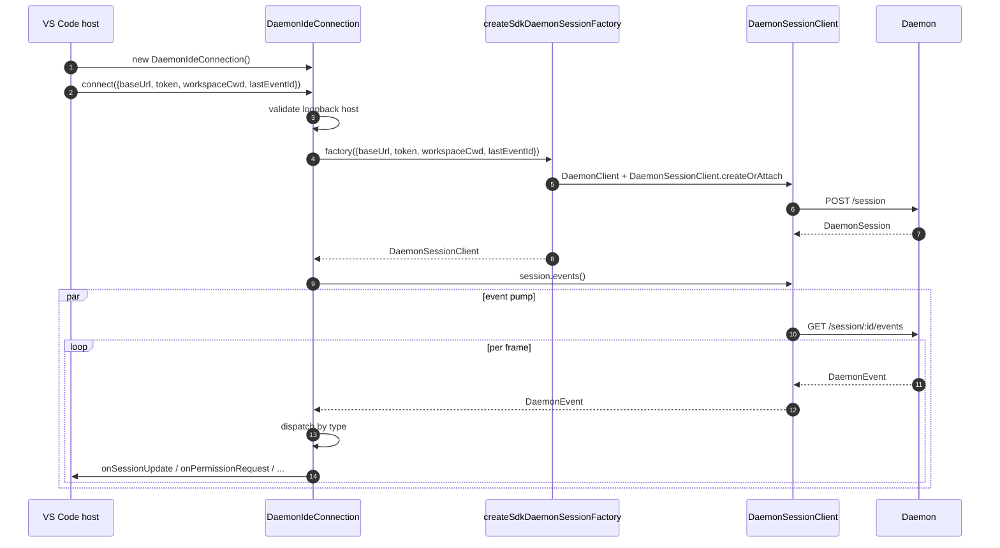
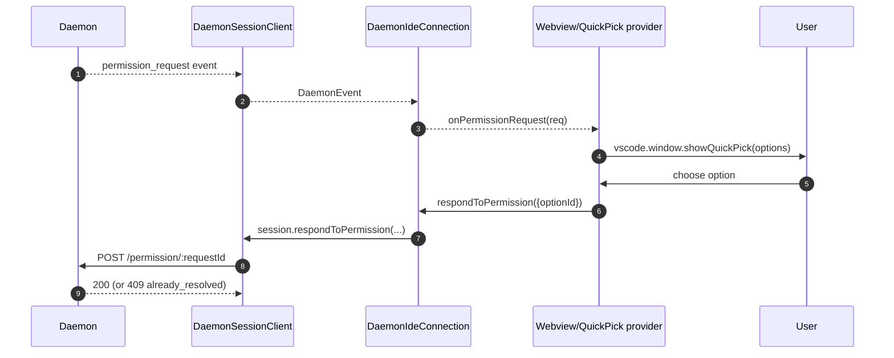
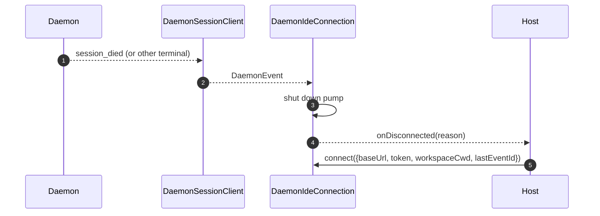

# VS Code IDE Daemon Adapter

## Overview

`packages/vscode-ide-companion/src/services/daemonIdeConnection.ts` is the **VS Code extension's daemon adapter**. It lets the IDE companion connect to a running `turbospark serve` daemon over HTTP + SSE instead of launching an in-process `qwen --acp` stdio child (the legacy `AcpConnectionState` path). It is the sibling-transport equivalent of [`14-cli-tui-adapter.md`](./14-cli-tui-adapter.md) for VS Code hosts.

The IDE's chat webview consumes daemon events through this adapter; permission prompts surface as native VS Code quick-pick dialogs.

## Responsibilities

- Construct a `DaemonClient` + `DaemonSessionClient` from a loopback-validated `baseUrl` passed to `connect(options)`.
- Pump SSE events from the session client into per-callback dispatch (`onSessionUpdate`, `onPermissionRequest`, `onAskUserQuestion`, `onEndTurn`, `onDisconnected`).
- Enforce a **loopback-only** invariant in `connect(options)` (the IDE should only ever connect to a daemon on the same host).
- Bridge daemon events into webview `postMessage`s so the chat panel stays in sync.
- Surface permission requests through VS Code's native quick-pick UI.
- Serialize calls into a queue so a rapid double-`connect()` from the host does not race.

## Architecture

### Public surface

```ts
class DaemonIdeConnection {
  connect(options: DaemonIdeConnectionOptions): Promise<void>;
  disconnect(): Promise<void>;
  sendPrompt(prompt: string | ContentBlock[]): Promise<DaemonIdePromptResult>;
  cancelSession(): Promise<void>;
  setModel(modelId: string): Promise<DaemonIdeSetModelResult>;

  onSessionUpdate: (data: SessionNotification) => void;
  onPermissionRequest: (
    data: RequestPermissionRequest,
  ) => Promise<{ optionId?: string }>;
  onAskUserQuestion: (data: AskUserQuestionRequest) => Promise<{
    optionId: string;
    answers?: Record<string, string>;
  }>;
  onEndTurn: (reason?: string) => void;
  onDisconnected: (code: number | null, signal: string | null) => void;
}

interface DaemonIdeConnectionOptions {
  baseUrl: string; // MUST be loopback (127.0.0.1 / localhost / [::1])
  token?: string;
  workspaceCwd?: string;
  modelServiceId?: string;
  lastEventId?: number;
  sessionFactory?: DaemonIdeSessionFactory;
}
```

### Loopback validation

In `connectInternal()`:

```ts
const baseUrl = validateDaemonBaseUrl(options.baseUrl);
```

This is a **client-side hard constraint** distinct from the daemon's own `hostAllowlist` (see [`12-auth-security.md`](./12-auth-security.md)). The IDE companion will never connect to a remote daemon — even if the operator configured one. Rationale: VS Code's threat model assumes the workspace and the daemon share the same host, including filesystem trust and related assumptions.

### `createSdkDaemonSessionFactory()`

`createSdkDaemonSessionFactory()` constructs `DaemonClient` and calls
`DaemonSessionClient.createOrAttach()` from `@turbospark/sdk`. The connection
class holds the factory rather than instantiating directly so tests can inject a
fake.

### Event dispatch

The connection runs one SSE consumer (`for await` over `session.events()`) and routes each event by type:

| Daemon event / source                                                                                   | IDE callback / action                                                    |
| ------------------------------------------------------------------------------------------------------- | ------------------------------------------------------------------------ |
| `session_update`                                                                                        | `onSessionUpdate`                                                        |
| Normal `permission_request`                                                                             | `onPermissionRequest`, then `respondToPermission()`                      |
| `permission_request` where `toolCall.kind === 'ask_user_question'` and `rawInput.questions` is an array | `onAskUserQuestion`, then forward `answers` to the daemon                |
| `session_died` with a payload `sessionId` matching the current session                                  | `onDisconnected(null, reason)`                                           |
| SSE natural end / stream failure / manual `disconnect()`                                                | `onDisconnected(null, 'stream_ended' / 'daemon_error' / 'disconnected')` |
| Other daemon events                                                                                     | Debug-level log; no IDE callback today.                                  |

`onEndTurn` is not produced by SSE dispatch. `sendPrompt()` waits for the daemon
HTTP prompt response and calls it with `response.stopReason`; non-abort
exception paths call `onEndTurn('error')`.

### Webview bridging

The connection class is **transport-only**. The actual VS Code integration lives in `packages/vscode-ide-companion/src/webview/providers/ChatWebviewViewProvider.ts` (and friends). The provider subscribes to the connection's callbacks and translates them into webview `postMessage` calls. The webview itself uses the shared `packages/webui/` component library to render — see Adapter Matrix in [`01-architecture.md`](./01-architecture.md).

### Connect serialization

`connect()` uses an internal queue so a rapid double call from the host (e.g. user opens the panel twice during an in-flight handshake) does not race. The second call awaits the first; the connection ends up in a single, deterministic state.

## Workflow

### Initial connect



### Permission via quick-pick



### Disconnect / recover



## State & Lifecycle

- Construction is synchronous; **no network I/O** until `connect(options)`.
- `connect()` is idempotent through the internal queue; calling twice serializes.
- `disconnect()` aborts the SSE iterator (`AbortController` on the pump) and clears callback registrations.
- `lastEventId` is captured from the SDK's `DaemonSessionClient` on disconnect and can be re-supplied on the next `connect()` for resume.

## Dependencies

- `packages/sdk-typescript/src/daemon/` — `DaemonClient`, `DaemonSessionClient` (the actual transport).
- VS Code extension API (`vscode.*`) — host APIs, quick-pick, webview.
- `packages/webui/src/adapters/ACPAdapter.ts` — webview rendering of ACP-shaped messages relayed via `postMessage`.

## Configuration

| Knob                                                 | Where                             | Effect                                                            |
| ---------------------------------------------------- | --------------------------------- | ----------------------------------------------------------------- |
| `baseUrl`                                            | `connect(options)`                | Daemon URL; must be loopback.                                     |
| `token`                                              | `connect(options)`                | Bearer token (stamped via SDK).                                   |
| `workspaceCwd`                                       | `connect(options)`                | Used on `POST /session`; must match the daemon's bound workspace. |
| `modelServiceId`                                     | `connect(options)` / `setModel()` | Initial model.                                                    |
| `lastEventId`                                        | `connect(options)`                | Resume cursor (typically restored from host state).               |
| VS Code setting `qwen.ide.daemonUrl` (or equivalent) | Workspace settings                | Operator-configured daemon URL.                                   |

## Caveats & Known Limits

- **Loopback-only — hard refusal in `connect(options)`.** Operators who want to point the IDE at a remote daemon need to use SSH port-forward / local proxy; the adapter will not connect to a non-loopback URL.
- **The legacy `AcpConnectionState` path is still primary** in the IDE companion (stdio child). This adapter is the sibling-transport for Mode-B migration; see [`../daemon-client-adapters/ide.md`](../daemon-client-adapters/ide.md) for the migration blockers and the planned `BridgeFileSystem` parity work.
- **No reverse RPC or editor-affordance surface yet over HTTP.** Features that require the agent to call back into the IDE (e.g. read-only buffer access, diff preview integration) currently live only on the stdio path.
- **Webview ↔ connection coupling is host-owned**, not in this adapter. Do not push webview-specific logic into `DaemonIdeConnection`.
- **`workspaceCwd` mismatch** with the daemon's bound workspace returns `400 workspace_mismatch` — surface this as a clear setup error rather than retrying.

## References

- `packages/vscode-ide-companion/src/services/daemonIdeConnection.ts`
- `packages/vscode-ide-companion/src/services/daemonIdeConnection.ts` (`createSdkDaemonSessionFactory`)
- `packages/vscode-ide-companion/src/types/connectionTypes.ts` (legacy `AcpConnectionState`)
- `packages/vscode-ide-companion/src/webview/providers/ChatWebviewViewProvider.ts` (webview bridge)
- `packages/webui/src/adapters/ACPAdapter.ts` (webview ACP-message adapter)
- Draft design: [`../daemon-client-adapters/ide.md`](../daemon-client-adapters/ide.md)
- SDK reference: [`13-sdk-daemon-client.md`](./13-sdk-daemon-client.md)
