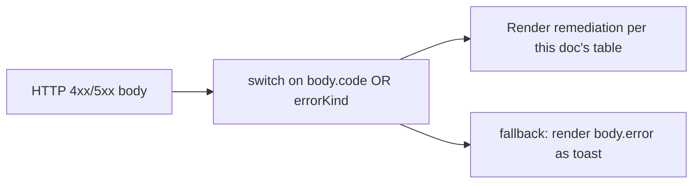
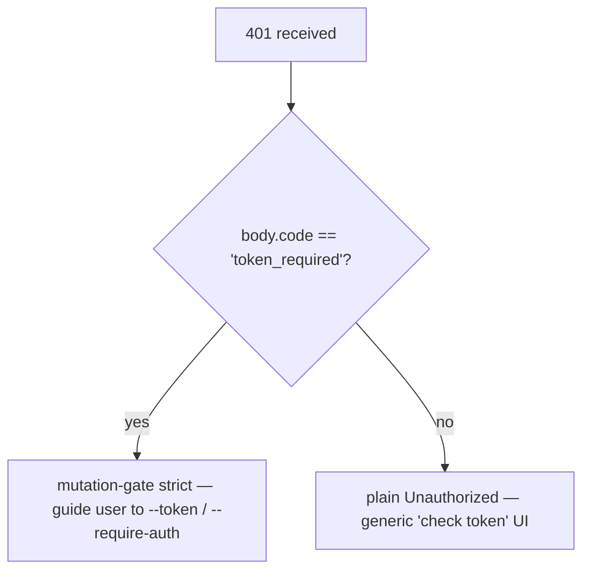

# Error Taxonomy & Remediation

## Overview

The daemon's failure modes are deliberately closed unions so SDK consumers can exhaustively switch and route handlers can shape consistent HTTP responses. This doc catalogues every typed error class / kind across three layers:

1. **`packages/cli/src/serve/`** — boundary errors at the HTTP edge (auth, workspace filesystem, daemon-host preflight).
2. **`packages/acp-bridge/`** — bridge / mediator errors at the daemon-to-ACP-child boundary.
3. **`packages/sdk-typescript/src/daemon/`** — SDK-side wrapping and structured error fields.

Wire-level error shapes are documented in [`../turbospark-serve-protocol.md`](../turbospark-serve-protocol.md); this doc adds cause and remediation guidance.

## Filesystem boundary (`packages/cli/src/serve/fs/errors.ts`)

`FsError` carries `{ kind, message, status, cause? }`. `FsErrorKind` union (14 kinds, default HTTP status):

| Kind                     | HTTP      | Cause                                                                          | Remediation                                                                                                             |
| ------------------------ | --------- | ------------------------------------------------------------------------------ | ----------------------------------------------------------------------------------------------------------------------- |
| `path_outside_workspace` | 400       | Resolved path leaves the bound workspace.                                      | Use a path inside the daemon's `workspaceCwd`; check `/capabilities`.                                                   |
| `symlink_escape`         | 400       | Target is a symlink.                                                           | Address the resolved path directly; symlinks are rejected by design.                                                    |
| `path_not_found`         | 404       | `ENOENT`.                                                                      | Confirm the file exists; check case-sensitive paths on Linux.                                                           |
| `binary_file`            | 422       | Content sniffed binary on a text route.                                        | Use `GET /file/bytes` for raw bytes; the text route refuses binaries.                                                   |
| `file_too_large`         | 413       | Above `MAX_READ_BYTES` (256 KiB) or `MAX_WRITE_BYTES` (5 MiB).                 | Use byte-range read; split the write.                                                                                   |
| `hash_mismatch`          | 409       | Optimistic-concurrency `expectedSha256` failed.                                | Re-read the file and retry with the new hash.                                                                           |
| `file_already_exists`    | 409       | `mode: 'create'` against an existing file.                                     | Use `mode: 'overwrite'` or pick a new path.                                                                             |
| `text_not_found`         | 422       | `POST /file/edit` search string not in file.                                   | Re-check the search string; whitespace / encoding mismatch is the usual cause.                                          |
| `ambiguous_text_match`   | 422       | Multiple matches when one was required.                                        | Add more surrounding context to the search string to make it unique.                                                    |
| `untrusted_workspace`    | 403       | Write attempted in an untrusted workspace.                                     | Mark the workspace trusted (`Config.isTrustedFolder()`) or use `runTurbosparkServe` instead of `createServeApp` direct embed. |
| `permission_denied`      | 403       | OS-level `EACCES` / `EPERM`.                                                   | Adjust filesystem ACLs; this is **not** a security alert.                                                               |
| `io_error`               | 503       | `ENOSPC` / `EIO` / `EBUSY` / `ETXTBSY` / `ENAMETOOLONG` / `EMFILE` / `ENFILE`. | Host-level operational fix (disk full, fd exhaustion); page ops, not security.                                          |
| `internal_error`         | 500       | Non-errno error reaches the boundary.                                          | Open a daemon bug.                                                                                                      |
| `parse_error`            | 400 / 422 | Request body parse error (400) or service-level invariant breach (422).        | Validate request body; check SDK version.                                                                               |

The `io_error` vs `permission_denied` distinction is deliberate so monitoring pipelines can route on `errorKind`; folding ENOSPC into `permission_denied` would page security responders for a `df -h` problem.

## Bridge errors (`packages/acp-bridge/src/bridgeErrors.ts`)

Typed classes thrown by the bridge / mediator. Most carry an HTTP status via the route handler's switch.

| Class                                 | HTTP | Cause                                                                                 | Remediation                                                                                                                                                                      |
| ------------------------------------- | ---- | ------------------------------------------------------------------------------------- | -------------------------------------------------------------------------------------------------------------------------------------------------------------------------------- |
| `SessionNotFoundError`                | 404  | sessionId not in `byId`.                                                              | Re-create or attach; the session may have been reaped.                                                                                                                           |
| `WorkspaceMismatchError`              | 400  | `POST /session` `cwd` ≠ daemon's `boundWorkspace`.                                    | Omit `cwd` (uses bound) or route to a daemon bound to your `cwd`.                                                                                                                |
| `SessionLimitExceededError`           | 503  | `byId.size >= maxSessions`.                                                           | Close stale sessions; bump `--max-sessions`.                                                                                                                                     |
| `InvalidClientIdError`                | 400  | `X-Qwen-Client-Id` outside `[A-Za-z0-9._:-]{1,128}`.                                  | Sanitize the client id.                                                                                                                                                          |
| `InvalidSessionMetadataError`         | 400  | `displayName` > 256 chars or contains control chars.                                  | Trim / sanitize.                                                                                                                                                                 |
| `InvalidSessionScopeError`            | 400  | Unknown `sessionScope` value.                                                         | Use `'single'` or `'thread'`.                                                                                                                                                    |
| `RestoreInProgressError`              | 409  | Concurrent `loadSession` / `resumeSession`.                                           | Wait + retry.                                                                                                                                                                    |
| `WorkspaceInitConflictError`          | 409  | `POST /workspace/init` against an existing file without `force`.                      | Pass `force: true` or pick another path.                                                                                                                                         |
| `WorkspaceInitPathEscapeError`        | 400  | Init path leaves workspace.                                                           | Use a path inside `workspaceCwd`.                                                                                                                                                |
| `WorkspaceInitSymlinkError`           | 400  | Init path is a symlink.                                                               | Address the resolved path.                                                                                                                                                       |
| `WorkspaceInitRaceError`              | 409  | TOCTOU race on init.                                                                  | Retry.                                                                                                                                                                           |
| `McpServerNotFoundError`              | 404  | Restart for an unknown server.                                                        | Verify server name in `/workspace/mcp`.                                                                                                                                          |
| `McpServerRestartFailedError`         | 502  | Restart failed inside ACP child.                                                      | Check ACP child logs; may indicate broken MCP server.                                                                                                                            |
| `InvalidPermissionOptionError`        | 400  | Wire vote tried to inject `CANCEL_VOTE_SENTINEL` via `optionId`.                      | Vote with `{outcome: 'cancelled'}` instead of an `optionId`.                                                                                                                     |
| `PermissionForbiddenError`            | 403  | Policy refused the voter (`designated_mismatch` / `remote_not_allowed`).              | Use the originator client id (designated), pre-register voter (consensus), or vote from loopback (local-only). See [`04-permission-mediation.md`](./04-permission-mediation.md). |
| `CancelSentinelCollisionError`        | 500  | Agent published `'__cancelled__'` as a legitimate option label.                       | Agent bug — change the option label to anything other than the sentinel.                                                                                                         |
| `PermissionPolicyNotImplementedError` | 500  | Requested policy not built into this daemon.                                          | Update daemon, or change `policy.permissionStrategy`.                                                                                                                            |
| `BridgeChannelClosedError`            | 503  | ACP child channel closed mid-call.                                                    | Reconnect / retry; check `session_died` for cause.                                                                                                                               |
| `BridgeTimeoutError`                  | 504  | Bridge-level wallclock exceeded.                                                      | Retry; investigate underlying slowness.                                                                                                                                          |
| `MissingCliEntryError`                | 500  | The `turbospark` CLI entry file is missing (defined in `status.ts`, not `bridgeErrors.ts`). | Confirm the CLI install is complete; check that `packages/cli/index.ts` exists.                                                                                                  |

## Boot-time configuration errors (`packages/cli/src/serve/runTurbosparkServe.ts`)

| Class                      | When                                                                                                                                                                                                                                      | Remediation                                                                                                                                                                                      |
| -------------------------- | ----------------------------------------------------------------------------------------------------------------------------------------------------------------------------------------------------------------------------------------- | ------------------------------------------------------------------------------------------------------------------------------------------------------------------------------------------------ |
| `InvalidPolicyConfigError` | `validatePolicyConfig()` rejects merged settings: unknown `policy.permissionStrategy` (validated against `SERVE_CAPABILITY_REGISTRY.permission_mediation.modes`) or non-positive-integer `policy.consensusQuorum`. Boot fails explicitly. | Fix the offending field in `settings.json`. The class supports `instanceof`; `runTurbosparkServe` uses it to distinguish policy mismatch from settings read I/O failures, which fall back to defaults. |

## Device Flow auth (`packages/cli/src/serve/auth/deviceFlow.ts`)

| Class                        | When                                                       | Notes                                                                                                                                                                                                                                                                                                                                                                                                                                    |
| ---------------------------- | ---------------------------------------------------------- | ---------------------------------------------------------------------------------------------------------------------------------------------------------------------------------------------------------------------------------------------------------------------------------------------------------------------------------------------------------------------------------------------------------------------------------------- |
| `UpstreamDeviceFlowError`    | The upstream IdP returns a structured error while polling. | `oauthError` is sanitized with `sanitizeForStderr` before interpolation into stderr or audit hints (CVE-2021-42574 / Trojan Source defense; see [`12-auth-security.md`](./12-auth-security.md)).                                                                                                                                                                                                                                         |
| `DeviceFlowPollTimeoutError` | The registry race timer fires before the provider returns. | Provider code must not throw this type. It is exported for tests, but the registry gates `pollTimedOut` on the runtime brand `_isRegistryTimeout: boolean`, not `instanceof`. A provider that imports and throws `new DeviceFlowPollTimeoutError(ms)` still follows the generic provider-throw audit path because `_isRegistryTimeout` defaults to `false`; only the internal factory `makeRegistryPollTimeoutError(ms)` sets the brand. |

## Daemon-host error kinds (`packages/acp-bridge/src/status.ts`)

`SERVE_ERROR_KINDS` is the closed enum used by diagnostic cells and structured daemon errors:

| Kind                       | Meaning                                                                 |
| -------------------------- | ----------------------------------------------------------------------- |
| `missing_binary`           | Required local executable or CLI entry could not be resolved.           |
| `blocked_egress`           | Outbound network probe failed.                                          |
| `auth_env_error`           | Auth-related env var, provider, or trust-gate configuration is invalid. |
| `init_timeout`             | Daemon-side init step exceeded its wallclock.                           |
| `protocol_error`           | ACP / HTTP protocol mismatch.                                           |
| `missing_file`             | Required local file missing.                                            |
| `parse_error`              | Local file or request parse error.                                      |
| `stat_failed`              | Local filesystem stat failed.                                           |
| `budget_exhausted`         | MCP budget enforcement refused discovery or a server entry.             |
| `mcp_budget_would_exceed`  | MCP restart or mutation would exceed the configured budget.             |
| `mcp_server_spawn_failed`  | MCP server spawn or restart failed.                                     |
| `invalid_config`           | MCP or daemon configuration was invalid.                                |
| `prompt_deadline_exceeded` | Prompt wallclock deadline expired.                                      |
| `writer_idle_timeout`      | SSE writer made no successful writes before its idle timeout.           |

These are surfaced through the preflight cell's `errorKind` so client UIs render structured remediation (not raw stack traces).

## Auth error shapes

| Status | Body                                         | When                                                                                                                                      |
| ------ | -------------------------------------------- | ----------------------------------------------------------------------------------------------------------------------------------------- |
| `401`  | `{ error: 'Unauthorized' }`                  | Missing / wrong / no-scheme bearer token. Uniform across `missing header` / `wrong scheme` / `wrong token` so probing cannot distinguish. |
| `401`  | `{ error: '...', code: 'token_required' }`   | Mutation-gate strict route on a no-token loopback daemon. SDKs render "configure --token / --require-auth" hint.                          |
| `403`  | `{ error: 'Request denied by CORS policy' }` | `denyBrowserOriginCors` rejected an `Origin`-bearing request.                                                                             |
| `403`  | `{ error: 'Invalid Host header' }`           | `hostAllowlist` rejected the `Host` header (DNS rebinding defense).                                                                       |

See [`12-auth-security.md`](./12-auth-security.md) for the full auth model.

## Permission outcomes (wire vs audit overload)

`PermissionResolution` has two terminal kinds:

- `{kind: 'option', optionId}` — a vote won.
- `{kind: 'cancelled', reason: 'timeout' \| 'session_closed' \| 'agent_cancelled'}` — request was cancelled. The wire shape is single (`{outcome: 'cancelled'}`); the audit log distinguishes timeout / session_closed / voter-cancelled / agent-cancelled in `decisionReason.type`. This overload is preserved deliberately to avoid breaking the frozen `permission.ts` contract.

## SDK-side error wrapping

`DaemonClient` returns HTTP errors as rejected Promises with the parsed body as the rejection value. Methods that hit `404` for unknown sessions reject with `{error, sessionId}`; the SDK does not wrap them in a typed class today. Callers should not rely on `instanceof Error` plus `.message.includes(...)` matching; switch on `err.code` or `err.kind` from the body instead.

`parseSseStream` aborts the iterator on 16-MiB buffer overflow (defensive bound).

## Workflow

### Surface an error to a user

### Distinguish auth failure modes

## Dependencies

- All error classes are exported from their respective packages; SDK consumers can `instanceof` against `bridgeErrors.ts` types when running in the same Node process. Across the wire, route on `body.code` / `body.kind` / `body.errorKind`.

## Caveats & Known Limits

- **`io_error` vs `permission_denied`** are distinct on purpose. Do not conflate.
- **`PermissionForbiddenError` reasons (`designated_mismatch` / `remote_not_allowed`) are overloaded** across the `designated` and `consensus` policies; the audit log distinguishes them precisely but the wire form does not.
- **`CancelSentinelCollisionError` indicates an agent-side bug**, not a security event — the bridge refuses the request rather than silently letting the sentinel match a real option.
- **SDK-side typed errors are still evolving.** Callers should route on body fields rather than relying on JS class identity through the wire.
- **`internal_error` should always be investigated.** It signals an `FsError` constructor was called with a kind reserved for non-errno paths (programmer error); the response body's `cause` field may carry the original throw.

## References

- `packages/cli/src/serve/fs/errors.ts` (`FsErrorKind`, `FsErrorStatus`)
- `packages/acp-bridge/src/bridgeErrors.ts` (every typed class)
- `packages/acp-bridge/src/status.ts` (`SERVE_ERROR_KINDS`, `ServeErrorKind`)
- `packages/cli/src/serve/auth.ts` (auth bodies)
- Wire reference: [`../turbospark-serve-protocol.md`](../turbospark-serve-protocol.md).
