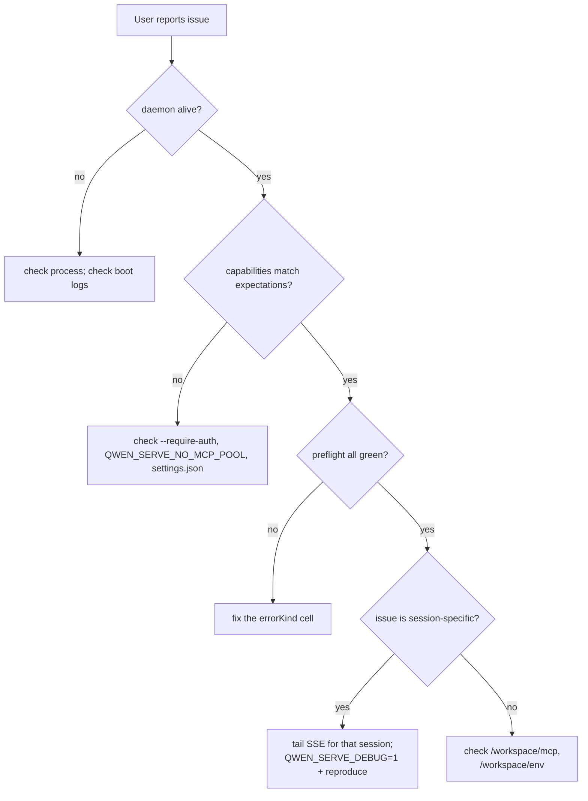

# Observability & Debugging

## Overview

`turbospark serve` currently ships with **OpenTelemetry span instrumentation**, **structured file logs** (`DaemonLogger`), **per-request access logs**, debug stderr logs, structured preflight cells, and an in-memory permission audit ring. This page is a practical guide to the current observability surface and the gaps to remember during triage.

## What exists today

| Surface                                     | Location                                       | Purpose                                                                                                                                                                                                                                                                                   |
| ------------------------------------------- | ---------------------------------------------- | ----------------------------------------------------------------------------------------------------------------------------------------------------------------------------------------------------------------------------------------------------------------------------------------- |
| `QWEN_SERVE_DEBUG` stderr logs              | `bridge.ts` and call sites                     | Env values `1` / `true` / `on` / `yes` (case-insensitive) print `turbospark serve debug: ...` lines to stderr.                                                                                                                                                                                  |
| OpenTelemetry span instrumentation          | `server.ts` `daemonTelemetryMiddleware`        | Each HTTP request is wrapped in `withDaemonRequestSpan`; attributes include route, sessionId, clientId, and status code. Permission routes have dedicated spans. Prompt lifecycle is traced end-to-end. Configuration lives in `settings.json` `telemetry`.                               |
| `DaemonLogger` structured file logs         | `serve/daemonLogger.ts`                        | Structured JSON-like log lines are written to a file. Boot prints `daemon log -> <path>`. Supports `info` / `warn` / `error` levels, with structured fields such as `route`, `sessionId`, `clientId`, `childPid`, and `channelId`.                                                        |
| Per-request access-log middleware           | `server.ts`, registered before `bearerAuth`    | Logs `method`, `path`, `status`, `durationMs`, `sessionId`, and `clientId` after each request. Skips `GET /health` and heartbeat. 4xx+ uses `warn`; success uses `info`.                                                                                                                  |
| `/health`                                   | `server.ts` route                              | Liveness probe; `?deep=1` returns extended details.                                                                                                                                                                                                                                       |
| `/capabilities`                             | `server.ts` route                              | Preflight feature discovery. See [`11-capabilities-versioning.md`](./11-capabilities-versioning.md).                                                                                                                                                                                      |
| `/workspace/preflight`                      | Route -> `DaemonStatusProvider`                | Structured readiness cells: Node version, CLI entry, ripgrep, git, npm, plus ACP-level cells once a child is alive.                                                                                                                                                                       |
| `/workspace/env`                            | Route -> `DaemonStatusProvider`                | Daemon process env snapshot. Secret env vars report only presence; proxy URL credentials are stripped.                                                                                                                                                                                    |
| `/workspace/mcp`                            | Route -> bridge extMethod                      | Pool, budget, and refusal snapshot.                                                                                                                                                                                                                                                       |
| `/workspace/skills`, `/workspace/providers` | Routes                                         | ACP-side live snapshots; return empty idle data when no session exists.                                                                                                                                                                                                                   |
| Per-session SSE                             | `GET /session/:id/events`                      | Real-time event stream.                                                                                                                                                                                                                                                                   |
| `/demo` debug console                       | `GET /demo` (`packages/cli/src/serve/demo.ts`) | Browser-accessible single-page console: chat, event log, workspace inspector, and permission UX. On loopback, `http://127.0.0.1:4170/demo` is the quickest end-to-end validation path without writing SDK code. Registration rules are in [`02-serve-runtime.md`](./02-serve-runtime.md). |
| `PermissionAuditRing`                       | `permissionAudit.ts`                           | In-memory FIFO of 512 permission decisions.                                                                                                                                                                                                                                               |
| Mediator `decisionReason` audit             | `permissionMediator.ts`                        | Internal structured record explaining why a permission request resolved the way it did.                                                                                                                                                                                                   |

## What does not exist today

- **No Prometheus / metrics endpoint.** There is no `process_cpu_seconds_total`, `http_requests_total`, or `event_bus_queue_depth`.
- **No external audit sink for `PermissionAuditRing`.** The ring exists, but fan-out hooks to SIEM or external storage are not wired.

## Debugging recipes

### 1. Is the daemon alive?

```bash
curl -s http://127.0.0.1:4170/health
# {"status":"ok"}

curl -s 'http://127.0.0.1:4170/health?deep=1' | jq
# {"status":"ok","workspaceCwd":"/path","sessions":N,...}
```

A 401 on loopback means `--require-auth` is likely enabled. Use `QWEN_SERVE_DEBUG=1` at startup to see boot logs.

### 2. Which features are advertised?

```bash
curl -s http://127.0.0.1:4170/capabilities | jq
```

Check `mcp_workspace_pool` (F2 pool on?), `require_auth` (hardened?), `permission_mediation.modes` (supported policies), and `policy.permission` (active policy).

### 3. Is daemon-host readiness healthy?

```bash
curl -s http://127.0.0.1:4170/workspace/preflight | jq
```

`status: 'not_started'` cells are ACP-level and populate only after the first session attaches. `status: 'fail'` cells include a closed `errorKind`; render structured remediation from [`18-error-taxonomy.md`](./18-error-taxonomy.md).

### 4. Tail a session SSE stream

```bash
curl -N -H 'Accept: text/event-stream' \
     -H 'Authorization: Bearer XYZ' \
     -H 'X-Qwen-Client-Id: debug-tail' \
     -H 'Last-Event-ID: 0' \
     'http://127.0.0.1:4170/session/<sid>/events'
```

`-N` disables curl output buffering. `Last-Event-ID: 0` requests replay for ring events with `id > 0`.

### 5. Why did a permission request resolve this way?

`PermissionAuditRing` is in-memory and has no HTTP surface today. Enable `QWEN_SERVE_DEBUG=1` and reproduce; the mediator prints structured lines for each vote and decision, including `decisionReason.type`. A later PR can expose the ring through HTTP.

### 6. Which consumer is slow?

`slow_client_warning` fires once per overflow episode when the queue reaches 75%. Subscribe to the session SSE stream and look for the synthetic frame; payload includes `queueSize`, `maxQueued`, and `lastEventId`. Repeated warnings point at a stuck consumer, usually a blocked SDK `for await` loop.

### 7. Why was an MCP server refused?

Combine `/workspace/mcp` per-cell `disabledReason: 'budget'`, the `refusedServerNames` list, and `mcp_child_refused_batch` SSE events. Compare them with `/capabilities` `mcp_guardrails.modes` (`enforce` active?) and the live `--mcp-client-budget` state visible through `getReservedSlots()`.

### 8. The daemon will not shut down

The first signal triggers graceful shutdown (see [`02-serve-runtime.md`](./02-serve-runtime.md)). If it hangs past 10s, check:

- ACP child process did not respond to graceful close.
- Long SSE connections kept HTTP `server.close()` open past `SHUTDOWN_FORCE_CLOSE_MS` (5s).

A **second** SIGTERM/SIGINT intentionally triggers `bridge.killAllSync()` + `process.exit(1)`.

## Flow

### Typical triage flow



## State and lifecycle

- `QWEN_SERVE_DEBUG` is read on every check through `isServeDebugMode()` from `debugMode.ts`; toggling it does not require restart. Boot logs are not available unless the env was set at boot.
- `PermissionAuditRing` is bounded at 512 FIFO entries; older records are silently dropped.
- `DaemonStatusProvider` rebuilds cells per request and does not cache; avoid unnecessary high-frequency polling.

## Dependencies

- `process.stderr.write` for debug stderr.
- `DaemonLogger` for structured file logs.
- OpenTelemetry SDK through `initializeTelemetry` and `createDaemonBridgeTelemetry`.
- `node:process` for env and signal inspection.

## Configuration

| Knob                            | Effect                                                                                       |
| ------------------------------- | -------------------------------------------------------------------------------------------- |
| `QWEN_SERVE_DEBUG`              | Enables verbose stderr logs. See [`17-configuration.md`](./17-configuration.md).             |
| `settings.json` `telemetry`     | Controls OTel behavior: `enabled`, `otlpEndpoint`, `otlpProtocol`, and per-signal endpoints. |
| `DaemonLogger` log path         | Generated at boot and printed to stderr as `daemon log -> <path>`.                           |
| `PermissionAuditRing` size      | Hard-coded to 512 today.                                                                     |
| `slow_client_warning` threshold | `0.75` / `0.375`, hard-coded in `eventBus.ts`.                                               |

## Caveats and known limits

- **DaemonLogger file logs are structured** and can be filtered by `route`, `sessionId`, and `clientId`. `QWEN_SERVE_DEBUG` stderr logs remain unstructured text.
- **OpenTelemetry spans include per-request correlation.** Each HTTP request span carries route, sessionId, and clientId attributes that can be joined in a tracing backend.
- **ACP-level `/workspace/preflight` cells require a live session.** On an idle daemon, auth / MCP / skills / providers may show `status: 'not_started'`; this is expected.
- **`/workspace/env` only reports secret presence, not values.** Do not expose the response where the mere presence of a secret is sensitive.
- **The audit ring is process-local** and history is lost on daemon restart.
- **No load-test recipe is documented here.** The performance baseline lives on the `test/perf-daemon-baseline` branch.

## References

- `packages/cli/src/serve/daemonStatusProvider.ts`
- `packages/cli/src/serve/daemonLogger.ts` (`DaemonLogger`, `buildDaemonLogLine`)
- `packages/cli/src/serve/debugMode.ts` (`isServeDebugMode`)
- `packages/acp-bridge/src/permissionMediator.ts` (`PermissionDecisionReason`)
- `packages/cli/src/serve/server.ts` (`daemonTelemetryMiddleware`, access-log middleware)
- Configuration: [`17-configuration.md`](./17-configuration.md)
- Error taxonomy: [`18-error-taxonomy.md`](./18-error-taxonomy.md)
- User operations guide: [`../../users/turbospark-serve.md`](../../users/turbospark-serve.md)
